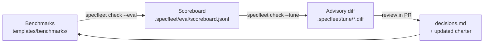

# Harness Management

Charters and skills are markdown — easy to write, easy to drift. The
**harness** is how SpecFleet keeps them honest over time. It is the
self-improvement loop the spec
([`docs/specs.md`](specs.md) Q4) asks for, made concrete.

The loop has three stages and three artifacts:

```
        ┌──────────────┐    eval    ┌──────────────┐    tune    ┌──────────────┐
        │  benchmarks  │ ─────────▶ │  scoreboard  │ ─────────▶ │ advisory diff│
        │   *.bench.md │            │   .jsonl     │            │   *.diff     │
        └──────▲───────┘            └──────────────┘            └──────┬───────┘
               │                                                       │
               │            review (human, PR)                         │
               └───────────────────────────────────────────────────────┘
                                   decisions.md
```



---

## 1. Author benchmarks

A benchmark is a markdown file describing what you expect a charter to
do given a brief. SpecFleet ships starter benchmarks under
[`templates/benchmarks/`](../templates/benchmarks/) for the orchestrator,
dev, test, compliance, and SRE charters.

A benchmark frontmatter block typically declares:

```yaml
---
charter: dev-backend
brief: "Add a /healthz endpoint that returns 200 OK"
expect:
  files_touched: ["src/**", "tests/**"]
  must_contain: ["healthz", "200"]
  must_not_contain: ["TODO", "FIXME"]
  max_tokens: 4000
---
```

Benchmarks are markdown so they are reviewed and versioned like any other
artifact. Add one whenever you encode a new norm (e.g. "Dev must always
write tests") so a regression has somewhere to land.

---

## 2. Run `specfleet check --eval`

```bash
specfleet check --eval                       # run all benchmarks
specfleet check --eval --charter dev-backend # one charter
specfleet check --eval --bench healthz       # one benchmark
```

Each run appends one JSON line per benchmark to
`.specfleet/eval/scoreboard.jsonl`:

```json
{"ts":"2025-04-27T12:00:00Z","bench":"healthz","charter":"dev-backend","pass":true,"score":0.92,"tokens":3120,"durationMs":18400,"notes":""}
{"ts":"2025-04-27T12:00:11Z","bench":"redact-pii","charter":"compliance","pass":false,"score":0.40,"tokens":2200,"durationMs":9100,"notes":"missed e-mail pattern"}
```

A regression is any line where `pass` flipped from `true` to `false`
relative to the previous run, or `score` dropped by more than the
configured tolerance. The scoreboard is append-only so trends are
visible without a database.

---

## 3. Read `specfleet check --tune` advisory diffs

`specfleet check --tune` consumes `scoreboard.jsonl`, the corresponding audit logs,
and `decisions.md`, then drafts a unified diff against the relevant
charter under `.specfleet/tune/<timestamp>.diff`:

```diff
--- a/.specfleet/charters/compliance.charter.md
+++ b/.specfleet/charters/compliance.charter.md
@@ -22,6 +22,7 @@ allowedTools: [read, grep]
 skills:
   - redact-pii
+  - email-pattern-coverage
```

`specfleet check --tune` **never auto-applies**. It is advisory — a human reviews the
diff in a PR, accepts or rejects, and writes the rationale into
`decisions.md` so the next iteration of the loop knows why.

---

## 4. Review in `decisions.md`

`decisions.md` is the org's append-only decision log (one row per
material decision: title, date, options considered, choice, rationale).
Every accepted tune diff produces a row; every rejected one too. The
loop is closed because:

- The charter changed under PR.
- The benchmark that drove the change is in `templates/benchmarks/`.
- The rationale is queryable via `specfleet mcp serve` →
  `query_decisions`.

---

## Operating cadence

| Cadence  | Action                                                                    |
| -------- | ------------------------------------------------------------------------- |
| Per PR   | `specfleet check --eval --charter <touched>` runs in CI; block on regression.           |
| Weekly   | Run full `specfleet check --eval`; triage any regression with `specfleet check --tune`.               |
| Monthly  | Review `scoreboard.jsonl` trends; retire flaky benchmarks; add new ones.  |
| Quarterly| Re-baseline scoring tolerances; archive old `tune/` diffs and audit logs. |

A team that follows this cadence sees charter quality monotonically
improve and prompt-drift caught within a week of introduction.

---

## Anti-patterns

The harness fails when one of these creeps in:

- **Overfitting to benchmarks.** If every benchmark is `must_contain:
  ["healthz"]`, the charter learns to print "healthz" and fails real
  work. Mix exact-match, regex, file-shape, and tool-trace expectations.
- **Brittle prompts.** Charters that depend on the exact wording of a
  brief don't generalize. Test the same intent worded three ways.
- **Hidden charter changes.** Edits made outside the PR flow break the
  audit chain between scoreboard, tune diff, and decision. Use
  CODEOWNERS on `.specfleet/charters/`.
- **Stale benchmarks.** A benchmark for a feature you removed will
  always pass and tells you nothing. Retire ruthlessly.
- **Tune diffs auto-applied.** `specfleet check --tune` is advisory by design. The
  moment a script applies its output unattended, the loop becomes a
  random walk.
- **No regression budget.** Without a tolerance config, a single noisy
  benchmark blocks every PR. Set `regressionTolerance` per charter.

---

## Where things live

| Artifact            | Path                                  |
| ------------------- | ------------------------------------- |
| Benchmark templates | `templates/benchmarks/`               |
| Live benchmarks     | `.specfleet/benchmarks/`                    |
| Scoreboard          | `.specfleet/eval/scoreboard.jsonl`          |
| Tune diffs          | `.specfleet/tune/<ts>.diff`                 |
| Decisions log       | `.specfleet/decisions.md`                   |
| Audit (per session) | `.specfleet/audit/<sessionId>.jsonl`        |

See also: [`docs/context-strategies.md`](context-strategies.md),
[`docs/security.md`](security.md).
