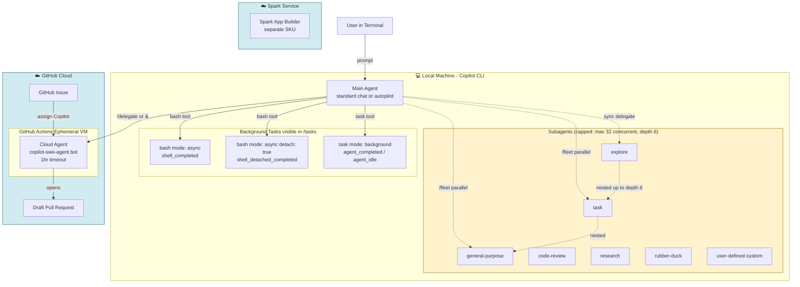

# GitHub Copilot CLI — Background Tasks, Subagent Limits, and the "Background vs Task vs Batch" Taxonomy

<!-- markdownlint-disable -->

**Research date:** 2026-05-01 (assistant working clock)
**Subject:** Concurrency, depth, and quota controls in GitHub Copilot CLI; disambiguation of "background activity" vs "task activity" vs "batch activity"
**Primary repo investigated:** `github/copilot-cli` (HEAD `cc85e32754fd29362d42a6107eba92c5551c764d`)
**Distribution:** npm `@github/copilot` (latest stable `v1.0.40`, prerelease `v1.0.41-0`)
**Confidence:** High for documented limits and changelog facts; Medium for cloud-agent concurrency caps (none published); Low for any "batch" semantics (no such named feature exists).

---

## Executive Summary

There are **three completely distinct surfaces** that all attract the word "background" in the GitHub Copilot ecosystem, and there is **no official feature called "batch."** Once you separate them, the limits become tractable:

1. **CLI subagents** (the `task` tool with `mode: "background"` and the `/fleet` slash command) — local, in your terminal, capped by `COPILOT_SUBAGENT_MAX_CONCURRENT=32` and `COPILOT_SUBAGENT_MAX_DEPTH=6` environment variables. These limits were introduced in **v1.0.22** (2026-04-09) "to prevent runaway agent spawning" and are clamped to the range 1–256.[^env-table]
2. **CLI background shell tasks** (the `bash` tool with `mode: "async"` and the optional `detach: true` for OS-detached processes) — local, ephemeral with the session unless detached, surfaced through `/tasks` and notification hooks (`shell_completed`, `shell_detached_completed`).[^hooks]
3. **Copilot Cloud Agent** (formerly "Coding Agent", invoked via `/delegate` from CLI, issue assignment, or 20+ third-party integrations) — runs in **GitHub Actions** ephemeral VMs in the cloud, costs **1 premium request per session** plus Actions minutes, has a **1-hour stuck-session timeout**, and currently has **no published concurrency cap** beyond your Actions runner quota.[^cloud-agent][^billing]

The word **"batch"** appears in exactly three corners of GitHub's documentation, and **none of them name a distinct feature**: (a) a single bullet on the CLI Autopilot page describing "scripting and CI workflows" use; (b) a UX tip about clicking "Start a review" in the GitHub PR UI rather than firing N individual `@copilot` comments; and (c) an undocumented description of the Security Campaigns "Assign to Copilot" multi-select UI.[^batch-audit]

The Copilot CLI binary itself is **closed source** — `github/copilot-cli` (MIT-licensed) only contains README, install.sh, LICENSE, and a 117 KB `changelog.md`. Behavioral semantics in this report are reconstructed from that changelog plus official docs at `docs.github.com/en/copilot/`.

---

## Section 1 — The Three Surfaces (Disambiguation Table)

| Surface | Where it runs | Invocation | Lifecycle | Cost model | Hard limits |
|---|---|---|---|---|---|
| **CLI subagents** (Concept #1) | Local machine, separate context window per subagent | `task` tool with `agent_type` (e.g. `explore`, `code-review`, `general-purpose`, `rubber-duck`, `research`); `/fleet` slash command makes the main agent fan out automatically | Tied to CLI session; each subagent has its own `agent_id`; multi-turn supported via `read_agent`/`write_agent` | Each subagent's LLM calls count toward the user's premium-request quota (with model multiplier) | `COPILOT_SUBAGENT_MAX_CONCURRENT=32`, `COPILOT_SUBAGENT_MAX_DEPTH=6` (both clamped 1–256)[^env-table] |
| **CLI background shells** (Concept #2) | Local machine | `bash` tool with `mode: "async"`; optional `detach: true` to fully detach as an OS process surviving session shutdown | Tied to session unless detached; visible in `/tasks`; can be killed with `k`/`x` key | No direct LLM cost (compute is local); permission gating via `permissionRequest` hook | No published numeric cap; `--max-autopilot-continues=5` bounds autopilot continuation steps[^changelog-1040] |
| **Cloud Agent** (Concept #3) | GitHub Actions ephemeral VM (cloud) | `/delegate` (CLI), assigning an issue to `Copilot`, `@copilot` mention in PR, Agents tab, GitHub MCP `assign_copilot_to_issue`, 20+ third-party integrations[^entry-points] | Cloud-hosted; survives local shutdown; produces a **draft PR** and requests review; one branch + one PR per task | **1 premium request / session** + GitHub Actions minutes; **dedicated SKU** since Nov 1, 2025[^billing] | 1-hour stuck-session timeout; 1 repo / 1 branch / 1 PR per task; **no concurrent-session cap published** (effectively bounded by Actions runner quota)[^cloud-agent] |

### The "Background Agent" Name Collision

Four different things in the docs all get tagged "background agent":

| Where the phrase appears | What it actually is |
|---|---|
| `code.visualstudio.com/docs/copilot/agents/background-agents` | A VS Code page about embedding **Copilot CLI sessions** that run on the user's local machine while the editor stays focused. NOT the cloud agent. |
| GA blog post 2025-05-19, "asynchronous, autonomous developer agent" | The **Cloud Agent** (formerly Coding Agent). |
| SDK `session.idle` event field `backgroundTasks` | Local CLI subagents and shells that outlive the main agent's turn. |
| CLI `/tasks` panel | Both async shells and background subagents listed together. |

Always anchor on the surface (Cloud Agent vs CLI), not the word.

---

## Section 2 — Concrete Limits (Verified Against Live Docs)

### 2.1 Subagent Concurrency & Depth (the JACKPOT findings)

These two environment variables are the only **numeric, configurable** subagent limits published anywhere in the official docs. Both appear in the live env-vars table at `docs.github.com/en/copilot/reference/copilot-cli-reference/cli-command-reference`.[^env-table]

| Environment variable | Default | Range | Effect |
|---|---|---|---|
| `COPILOT_SUBAGENT_MAX_CONCURRENT` | **32** | 1–256 | Maximum concurrent subagents **across the entire session tree**. Counts every running subagent regardless of depth. New requests are **rejected** when the limit is reached, until an active agent completes. |
| `COPILOT_SUBAGENT_MAX_DEPTH` | **6** | 1–256 | Maximum subagent **nesting depth**. Subagent A spawning subagent B counts as depth 2. When the limit is reached, the innermost agent **cannot spawn further subagents** but the existing tree continues. |

Verbatim from the Custom-agents reference page:

> **Concurrency** counts how many subagents are running simultaneously across the entire session tree. When the limit is reached, new subagent requests are rejected until an active agent completes. Values are clamped between `1` and `256`.[^env-table]

> **Depth** counts how many agents are nested within one another. When the depth limit is reached, the innermost agent cannot spawn further subagents. Values are clamped between `1` and `256`.[^env-table]

**Introduced:** `v1.0.22` (2026-04-09) — "Add sub-agent depth and concurrency limits to prevent runaway agent spawning."[^changelog-1022]

### 2.2 Autopilot Continuation Cap

| Flag | Default | Effect |
|---|---|---|
| `--max-autopilot-continues=COUNT` | **5** (per v1.0.40 changelog) | Maximum number of "continue" responses the model can issue before autopilot must stop and yield to the user. |

⚠️ **Live docs lag**: the CLI command-reference page still says "default: unlimited" as of this research, but the **v1.0.40 changelog (2026-05-01) is authoritative**:

> Autopilot mode now limits continuation messages to **5 by default** (configurable with `--max-autopilot-continues`)[^changelog-1040]

### 2.3 Session and Weekly Quotas (Qualitative)

The page at `docs.github.com/en/copilot/concepts/rate-limits` (also served at `/concepts/usage-limits`) states:

> GitHub Copilot has two limits: a **session** and a **weekly (7-day) limit**.
>
> - **Session limit.** If you hit the session limit, you must wait until it resets before you can resume using Copilot.
> - **Weekly limit.** This limit caps the total number of tokens you can consume during a 7-day period.
>
> **Reduce parallel workflows.** Parallelized tools result in higher token consumption. Use them sparingly if you are nearing your limits.[^rate-limits]

**No numeric session-token or weekly-token caps are published.** Warning thresholds surface in the changelog only:

- `v1.0.33` (2026-04-20): "Show usage limit warnings at 50% and 95% capacity"[^changelog-1033]
- `v1.0.32` (earlier): "Show warnings when approaching 75% and 90% of your weekly usage limit"

### 2.4 Cloud Agent Limits

| Constraint | Value | Source |
|---|---|---|
| Premium requests per session | 1 (only the user's prompt counts; tool calls do not) | Billing docs[^billing] |
| Steering message cost | 1 premium request per steering message | `track-copilot-sessions` |
| Stuck-session timeout | **1 hour** | `troubleshoot-cloud-agent`[^cloud-agent] |
| Repositories per session | 1 | `about-cloud-agent` Limitations |
| Branches per session | 1 | `about-cloud-agent` Limitations |
| PRs opened per task | exactly 1 | `about-cloud-agent` Limitations |
| Concurrent sessions cap | **NOT DOCUMENTED** | — (effectively bounded by Actions runner quota and premium-request budget) |
| Queue depth | **NOT DOCUMENTED** | — |
| Default branch protection | Cannot push directly to default branch; only to existing PR branch (via `@copilot`) or a fresh `copilot/*` branch | `responsible-use/copilot-cloud-agent` |

---

## Section 3 — The Six Execution Modes

This section unpacks every distinct way the agentic loop can spawn work, with verbatim citations.

### Mode 1: `bash` tool, `mode: "sync"` — Synchronous Shell

**Behavior:** Standard blocking shell exec. The tool call returns when the process exits, with full stdout/stderr piped back to the LLM context.

- Lifecycle: lives and dies inside one agent turn
- Hooks: `preToolUse` → run → `postToolUse` (or `postToolUseFailure`)
- Notification hooks: **none** (the `shell_completed` notification only fires for async)
- Visible in `/tasks`: **no**

### Mode 2: `bash` tool, `mode: "async"` — Async Shell in Session

**Behavior:** Tool returns a shell ID immediately and the process runs in parallel with the agent. Tied to the CLI session — terminated on session exit unless `detach: true`.

- Hooks fired: `preToolUse` (sync), then `shell_completed` notification on exit
- Visible in `/tasks`: **yes**
- User can kill with `k` or `x` in `/tasks`
- **Non-interactive (`-p`) prompt mode does NOT wait** for async shells before exit (contrast: it DOES wait for background subagents — see Mode 5)

Changelog evidence:

> **v1.0.18** (2026-04-04): "Add notification hook event that fires asynchronously on shell completion, permission prompts, elicitation dialogs, and agent completion"[^changelog-history]
> **v1.0.21** (2026-04-07): "Spinner no longer appears stuck when a long-running async shell command is active"[^changelog-history]

### Mode 3: `bash` tool, `mode: "async"`, `detach: true` — Detached Process

**Behavior:** Fully detached from the CLI session. Survives `copilot` exit as an independent OS process (uses `setsid` on Unix).

- Hooks fired: `preToolUse` (sync), then `shell_detached_completed` notification on exit (a separate notification type from `shell_completed`)
- Use cases: web servers, dev daemons, file watchers, anything that should outlive the session

Changelog evidence:

> **v0.0.344** (2025-10-17): "Added support to the bash tool for executing detached processes"[^changelog-history]
> **v0.0.403** (2026-02-04): "Detached shell processes work on vanilla macOS installations"[^changelog-history]
> **v1.0.39** (2026-04-28): "Press ctrl+x → b to move the current running task or shell command to the background"[^changelog-history]

### Mode 4: `task` tool, `mode: "sync"` — Synchronous Subagent

**Behavior:** Main agent dispatches a subagent and **blocks until the subagent fully completes**, then injects the result into its context. The subagent has its own context window.

⚠️ **Important behavioral history** — there is a pre/post-`v1.0.35` distinction:

> **v1.0.35** (2026-04-23): "Sync task calls block until completion under `MULTI_TURN_AGENTS` instead of auto-promoting to background after 60s; sync no longer returns a reusable `agent_id`, use `mode: "background"` for follow-ups"[^changelog-1035]

This reveals two things:

1. Before v1.0.35, sync subagents would **silently auto-promote to background after 60 seconds**. This caused subtle bugs where downstream code expected an inline result and instead got a background handle.
2. Post-v1.0.35, sync calls block reliably and **do not return a reusable `agent_id`** — if you want multi-turn, you must use `mode: "background"`.

The `MULTI_TURN_AGENTS` env var **is functional but officially undocumented** in the env-vars table. It governs this behavior.

Hooks fired: `subagentStart` (at spawn) → subagent's own `preToolUse`/`postToolUse` cycle → `subagentStop` (at completion).

### Mode 5: `task` tool, `mode: "background"` — Background Subagent

**Behavior:** Tool returns an `agent_id` immediately. Subagent runs concurrently. Multi-turn back-and-forth via `read_agent(agent_id)` and `write_agent(agent_id, message)`.

| Notification type | Triggered by |
|---|---|
| `agent_completed` | Background subagent finishes (completed or failed) |
| `agent_idle` | Background agent finishes a turn and waits for `write_agent` input |

Changelog evidence:

> **v0.0.404** (2026-02-05): "Add `/tasks` command to view and manage background tasks" + "Enable background agents for all users"[^changelog-history]
> **v1.0.5** (2026-03-13): "Send follow-up messages to background agents with the write_agent tool for multi-turn conversations"[^changelog-history]
> **v1.0.11** (2026-03-23): "Background agent progress (current intent and tool calls completed) now surfaces in read_agent and task timeout responses"[^changelog-history]
> **v1.0.33** (2026-04-20): "Non-interactive mode waits for all background agents to finish before exiting"[^changelog-1033]

In non-interactive (`-p`) prompt mode, the runtime **awaits all background subagents** before exiting (unlike async shells, which are not waited).

### Mode 6: Cloud Agent (Coding Agent / "Background Agent on GitHub")

**Behavior:** A separate, fully cloud-hosted system. Invoked by `/delegate PROMPT` (or `& PROMPT`) from the CLI, by issue assignment, by `@copilot` mention, or by 20+ third-party integrations.

| Dimension | CLI `bash`/`task` tools | Cloud Agent |
|---|---|---|
| Where | Local machine | GitHub Actions ephemeral VM |
| Lifecycle | Tied to session (or detached OS process) | Cloud-hosted, survives local shutdown |
| Output | Returns to main agent context | Branch + draft PR on GitHub |
| Bot identity | User auth | `copilot-swe-agent[bot]` |
| Cost | Premium requests per LLM interaction | 1 premium request per session + Actions minutes |
| Cross-repo | Touches any local files | Scoped to one repository |

Verbatim from the docs:

> **`/delegate`** pushes the task to Copilot cloud agent on GitHub. The work runs remotely: Copilot creates a branch, opens a draft pull request, and works in the background. Use /delegate when you want to hand off a task entirely and continue running even if you shut down your local machine.[^delegate]

---

## Section 4 — Hooks Reference (Verbatim)

The Copilot CLI exposes a comprehensive hooks system that fires at every meaningful lifecycle point. From `docs.github.com/en/copilot/reference/copilot-cli-reference/cli-hooks-reference`:[^hooks]

### 4.1 All Hook Event Types

| Event | Fires when | Output processed |
|---|---|---|
| `agentStop` | Main agent finishes a turn | Yes — can block and force continuation |
| `errorOccurred` | An error occurs during execution | No |
| `notification` | Async notifications fire-and-forget (shell completion, agent completion/idle, permission prompts, elicitation dialogs) | Optional — can inject `additionalContext` |
| `permissionRequest` | Before the permission service runs | Yes — can allow or deny programmatically |
| `postToolUse` | After each tool completes successfully | Yes — can replace successful result (SDK programmatic hooks only) |
| `postToolUseFailure` | After a tool completes with a failure | Yes — can provide recovery guidance via `additionalContext` (exit code 2) |
| `preCompact` | Context compaction is about to begin (supports `matcher` for `"manual"` or `"auto"`) | No — notification only |
| `preToolUse` | Before each tool executes | Yes — can allow, deny, or modify |
| `sessionEnd` | Session terminates | No |
| `sessionStart` | New or resumed session begins | No |
| `subagentStart` | A subagent is spawned (returns `additionalContext` prepended to the subagent's prompt) | No — cannot block creation |
| `subagentStop` | A subagent completes | Yes — can block and force continuation |
| `userPromptSubmitted` | User submits a prompt | No |

### 4.2 All Notification Types

| Notification type | Triggered by |
|---|---|
| `shell_completed` | `bash` tool, `mode: "async"` (session-tied) completes |
| `shell_detached_completed` | `bash` tool, `mode: "async"`, `detach: true` completes |
| `agent_completed` | `task` tool, `mode: "background"` subagent finishes |
| `agent_idle` | Background subagent finishes a turn and waits for `write_agent` |
| `permission_prompt` | Tool requests permission |
| `elicitation_dialog` | Agent requests info from user |

### 4.3 Hook Configuration Types

| Type | Description | Available on |
|---|---|---|
| `command` | Run a shell script | All hook types |
| `prompt` | Auto-submit text | `sessionStart` only, only for new interactive sessions |
| `http` | POST JSON payload to a URL | All hook types (added v1.0.35) |

---

## Section 5 — Premium Request Model & Plan Quotas

### 5.1 The Three Premium-Request SKUs (Since 2025-11-01)

> Premium requests for Spark and Copilot cloud agent are tracked in **dedicated SKUs** from November 1, 2025. This provides better cost visibility and budget control for each AI product.[^billing]

| SKU | What consumes it |
|---|---|
| **Copilot premium requests** | Chat, CLI, Code Review, Extensions, Spaces — every user prompt × model multiplier |
| **Spark premium requests** | GitHub Spark app creation (Pro+/Enterprise only) |
| **Copilot cloud agent premium requests** | Each cloud-agent session start + each steering message |

### 5.2 What Counts as a Premium Request

> For agentic features, only the prompts you **send** count as premium requests; actions Copilot takes autonomously to complete your task, such as tool calls, do **not**.[^billing]

So in the CLI:
- ✅ Each user prompt = 1 premium request × model multiplier
- ✅ Each `/fleet` subagent's LLM interaction = 1 premium request (multiplied across many subagents)
- ❌ A `bash` tool call is free
- ❌ A subagent spawning a child subagent without an extra LLM call is free
- ✅ A `/delegate` cloud-agent session = 1 premium request (cloud-agent SKU)
- ✅ Each steering message to a cloud agent = 1 premium request (cloud-agent SKU)

> Each subagent can interact with the LLM independently of the main agent, so splitting work up into smaller tasks that are run by subagents may result in more LLM interactions than if the work was handled by the main agent. Using `/fleet` in a prompt may therefore cause more premium requests to be consumed.[^fleet]

### 5.3 Plan Comparison

| Plan | Monthly Copilot premium requests | Cloud-agent SKU | Spark SKU |
|---|---|---|---|
| Free | 50 | Shared from Copilot allowance | ❌ |
| Pro | 300 | Shared from Copilot allowance | ❌ |
| Pro+ | 1,500 | Shared from Copilot allowance | ✅ |
| Business | 300 / user | 300 / user pool | ❌ |
| Enterprise | 1,000 / user | 1,000 / user pool | ✅ |

Default CLI model: **Claude Sonnet 4.5** (1× multiplier). Subagents default to a "low-cost AI model" (lower multiplier).[^fleet]

### 5.4 Coming June 1, 2026: AI Credits

The model-multiplier scheme is being replaced by an **AI Credits** token-based billing system. Existing premium-request allowances will convert to AI Credits at a published exchange rate. Watch the billing docs for the transition.

---

## Section 6 — Slash Commands and Other Surfaces

### 6.1 Key CLI Slash Commands

| Command | What it does | Cost impact |
|---|---|---|
| `/fleet` | Main agent fans out subagents in parallel for the next prompt | **Multiplies** premium requests across subagents |
| `/delegate` | Hands off to Cloud Agent (separate SKU) | 1 cloud-agent premium request per delegate |
| `/tasks` | View and manage background tasks (async shells + background subagents) | Free |
| `/usage` | View premium-request consumption | Free |
| `/agent` | Switch between custom agents in current session | Free |
| `/research` | Multi-step research workflow (uses orchestrator/subagent model in v1.0.40+) | Multiple premium requests |
| `/plan` | Plan-mode workflow (Shift+Tab) | Free |
| `/compact` | Manually compact session context | Free |
| `/resume`, `/continue` | Resume a previous session | Free |
| `/session` | List/manage sessions | Free |
| `/model` | Switch model | Free |
| `/release-notes`, `/upgrade`, `/bug` | Aliases added in v1.0.33 | Free |

### 6.2 Built-in Custom Agents

Per `docs.github.com/en/copilot/concepts/agents/copilot-cli/about-custom-agents`:[^custom-agents]

| Agent | Purpose |
|---|---|
| **Explore** | Quick codebase analysis with separate context — answers questions without polluting main context |
| **Task** | Runs commands (tests, builds, linters, dependency installs); brief summary on success, full output on failure |
| **General-purpose** | Complex multi-step tasks needing the full toolset and high-quality reasoning |
| **Code-review** | Reviews changes, surfaces only genuine issues, minimizes noise |
| **Research** | Thorough searches with citations (orchestrator/subagent model in v1.0.40+) |
| **Rubber-duck** | Independent critique on plans/implementations (catches bugs and design flaws) |
| **Configure-copilot** | Manages Copilot CLI MCP server config |

The `task` tool's `agent_type` parameter accepts these names; users can also define custom agents via `.github/agents/<name>.md`.

### 6.3 Customization Surfaces

From `docs.github.com/en/copilot/reference/customization-cheat-sheet`:

| Feature | Configured in |
|---|---|
| Custom instructions | `.github/copilot-instructions.md`, `AGENTS.md` |
| Prompt files | `.github/prompts/*.prompt.md` |
| Custom agents | `.github/agents/<NAME>.md` |
| Subagents (runtime) | N/A — runtime processes |
| Agent skills | `.github/skills/<NAME>/SKILL.md` |
| Hooks | `.github/hooks/*.json` |
| MCP servers | `.mcp.json` (local) — note: `.vscode/mcp.json` and `.devcontainer/devcontainer.json` were **removed as MCP sources in v1.0.22**[^changelog-1022] |

### 6.4 Cloud-Agent Entry Points (20+)

GitHub Issues UI, GitHub Issues GraphQL/REST API, GitHub Projects, Agents tab, Dashboard, Copilot Chat (VS Code / JetBrains / Eclipse / Visual Studio 2026 / GitHub.com), Copilot CLI (`/delegate` or `&`), GitHub Mobile, GitHub MCP server (`assign_copilot_to_issue`), Raycast, "New repository" form, Jira, Slack, Microsoft Teams, Azure Boards, Linear, Security Campaigns ("Assign to Copilot" multi-select).[^entry-points]

---

## Section 7 — Mermaid Mental Model

---

## Section 8 — When to Use Which Surface

From `docs.github.com/en/copilot/how-tos/copilot-cli/cli-best-practices`:

| Scenario | Recommended approach | Why |
|---|---|---|
| Parallelizable multi-file work | `/fleet` (CLI subagents in `mode: "background"`) | Local, full filesystem access, fast iteration; multiplied premium requests are worth it for genuinely parallel work |
| Long async tasks you don't want to wait for | `/delegate` (Cloud Agent) | Survives local shutdown, produces a PR, doesn't block the CLI |
| Fast synchronous subagent work | Main agent auto-delegates to built-in agents (sync mode) | No overhead, result inlined |
| Autonomous multi-step completion | Autopilot mode (Shift+Tab×2) | Bounded by `--max-autopilot-continues=5` |
| Tangential / refactor / docs work | `/delegate` | Clean handoff, doesn't pollute current context |
| Core feature work, debugging, exploration | Local CLI (interactive) | Fast feedback, full visibility |
| Long-running servers/watchers | `bash` with `mode: "async"`, `detach: true` | Survives session exit |

> Optionally, you can usually speed up large tasks by using the `/fleet` slash command at the start of your prompt to allow Copilot to break the task into parallel subtasks that are run by subagents.[^best-practices]

---

## Section 9 — "Batch" — Full Audit Conclusion

The user explicitly asked about "batch activity." After exhaustive search of all official Copilot docs, **no feature is officially named "batch"**:

| Where "batch" appears | What it actually means |
|---|---|
| CLI Autopilot concept doc, "Benefits" section | A single bullet: *"Batch operations: Useful for scripting and CI workflows where you want Copilot to run to completion."* — describes using autopilot non-interactively in scripts. Not a feature name. |
| Best-practices doc, GitHub PR review UI | UX tip: click "Start a review" rather than "Add single comment" so you can *"batch them"* — about the GitHub PR review UX, not Copilot. |
| Security Campaigns "Assign to Copilot" UI | Multi-select alerts, click button, get N PRs — **the docs do not call this "batch"**. The official feature name is "Assign to Copilot." |
| GA blog 2025-05-19 ("asynchronous, autonomous developer agent") | Cloud Agent is described as *async*, not *batch*. |
| GitHub MCP server tools | `assign_copilot_to_issue` is single-issue; **no `assign_multiple` or batch variant exists**. |

So when someone says "batch activity" in the Copilot context, they almost always mean one of:
1. **`/fleet` parallelism** (multiple CLI subagents at once) → see Section 1, Concept #1
2. **CLI Autopilot** running non-interactively in a script → see Section 8
3. **Multiple Cloud Agent sessions** assigned in parallel → see Section 1, Concept #3
4. The Security Campaigns multi-alert UI → undocumented as "batch"

There is no fourth, distinct "batch" surface.

---

## Section 10 — Open Issues in `github/copilot-cli`

These public issues constrain or clarify how the limits behave in practice:

| # | Title | Status | Relevance |
|---|---|---|---|
| **#2132** | OOM crash during parallel background agent execution | Open | Practical concurrency upper bound: users report OOM with 4–7 parallel agents, well below the `MAX_CONCURRENT=32` default. Memory headroom matters more than the configured cap. |
| **#2595** | Background agent completion retention (purged in seconds) | Open | Completed background agents are purged from the runtime in seconds, making post-mortem inspection awkward. |
| **#2712** | Rate limit behavior during /fleet | Open | What happens when subagents collectively exhaust the weekly token cap mid-fleet — not gracefully handled. |
| **#2992** | Tool scoping for sub-agents (>128 tools rejected) | Open | Subagents inherit/declare tool sets; declaring more than 128 tools causes the agent to be rejected. |

---

## Section 11 — Full Environment Variables Table

From `docs.github.com/en/copilot/reference/copilot-cli-reference/cli-command-reference`:[^env-table]

### 11.1 Core (19 documented)

| Variable | Description |
|---|---|
| `COLORFGBG` | Fallback for dark/light terminal background detection |
| `COPILOT_ALLOW_ALL` | Set to `true` to allow all permissions automatically (== `--allow-all`) |
| `COPILOT_AUTO_UPDATE` | Set to `false` to disable automatic updates |
| `COPILOT_CACHE_HOME` | Override cache directory (marketplace caches, auto-update packages) |
| `COPILOT_CUSTOM_INSTRUCTIONS_DIRS` | Comma-separated list of additional directories for custom instructions |
| `COPILOT_EDITOR` | Editor command (after `$VISUAL` and `$EDITOR`); defaults to `vi` |
| `COPILOT_GH_HOST` | GitHub hostname for Copilot CLI only, overriding `GH_HOST` |
| `COPILOT_GITHUB_TOKEN` | Authentication token. Takes precedence over `GH_TOKEN` and `GITHUB_TOKEN` |
| `COPILOT_HOME` | Override the configuration and state directory. Default: `$HOME/.copilot` |
| `COPILOT_MODEL` | Set the AI model |
| `COPILOT_PROMPT_FRAME` | Set to `1`/`0` to enable/disable decorative UI frame |
| `COPILOT_SKILLS_DIRS` | Comma-separated list of additional directories for skills |
| **`COPILOT_SUBAGENT_MAX_CONCURRENT`** | **Maximum concurrent subagents across the entire session tree. Default: `32`. Range: `1`–`256`** |
| **`COPILOT_SUBAGENT_MAX_DEPTH`** | **Maximum subagent nesting depth. Default: `6`. Range: `1`–`256`** |
| `GH_HOST` | GitHub hostname for both gh and Copilot CLI (default: `github.com`) |
| `GH_TOKEN` | Authentication token. Takes precedence over `GITHUB_TOKEN` |
| `GITHUB_TOKEN` | Authentication token |
| `PLAIN_DIFF` | Set to `true` to disable rich diff rendering |
| `USE_BUILTIN_RIPGREP` | Set to `false` to use the system ripgrep instead of the bundled version |

### 11.2 OTel Telemetry (10 vars)

| Variable | Default | Description |
|---|---|---|
| `COPILOT_OTEL_ENABLED` | `false` | Explicitly enable OTel |
| `OTEL_EXPORTER_OTLP_ENDPOINT` | — | OTLP endpoint URL (auto-enables OTel) |
| `COPILOT_OTEL_EXPORTER_TYPE` | `otlp-http` | Exporter type: `otlp-http` or `file` |
| `OTEL_SERVICE_NAME` | `github-copilot` | Service name in resource attributes |
| `OTEL_RESOURCE_ATTRIBUTES` | — | Comma-separated `key=value` |
| `OTEL_INSTRUMENTATION_GENAI_CAPTURE_MESSAGE_CONTENT` | `false` | Capture full prompt/response content |
| `OTEL_LOG_LEVEL` | — | OTel diagnostic log level |
| `COPILOT_OTEL_FILE_EXPORTER_PATH` | — | Write JSON-lines to file |
| `COPILOT_OTEL_SOURCE_NAME` | `github.copilot` | Instrumentation scope name |
| `OTEL_EXPORTER_OTLP_HEADERS` | — | Auth headers for OTLP exporter |

### 11.3 Functional but Officially Undocumented (Discovered via Changelog)

| Variable | Introduced | Behavior |
|---|---|---|
| `MULTI_TURN_AGENTS` | v1.0.35 | Sync task calls block until completion instead of auto-promoting to background after 60s |
| `GITHUB_COPILOT_PROMPT_MODE_REPO_HOOKS` | v1.0.40 | Opt-in: enables repo hooks in prompt mode (`-p`) |
| `GITHUB_COPILOT_PROMPT_MODE_WORKSPACE_MCP` | v1.0.40 | Opt-in: enables workspace MCP servers in prompt mode (`-p`) |
| `COPILOT_AGENT_SESSION_ID` | v1.0.29 | Injected into shell commands and MCP server environments |
| `COPILOT_CLI=1` | v0.0.421 | Set so git hooks can detect Copilot CLI subprocesses |
| `COPILOT_DISABLE_TERMINAL_TITLE` | v1.0.28 | Opt out of terminal title updates |
| `BASH_ENV` | — | Used with `--bash-env` / `--no-bash-env` flags |
| `MCP_ENTERPRISE_ALLOWLIST` | — | Experimental flag for enterprise MCP allowlist |

---

## Section 12 — Key Repos and Sources

| Source | URL / Path |
|---|---|
| **Copilot CLI repo (closed source)** | `github.com/github/copilot-cli` |
| Copilot CLI changelog (117 KB) | `github.com/github/copilot-cli/blob/main/changelog.md` |
| Copilot SDK (RPC types) | `github.com/github/copilot-sdk` — `nodejs/src/generated/rpc.ts` |
| Copilot SDK (streaming events) | `github.com/github/copilot-sdk` — `docs/features/streaming-events.md` |
| **CLI command reference** | `docs.github.com/en/copilot/reference/copilot-cli-reference/cli-command-reference` |
| CLI hooks reference | `docs.github.com/en/copilot/reference/copilot-cli-reference/cli-hooks-reference` |
| `/fleet` concept | `docs.github.com/en/copilot/concepts/agents/copilot-cli/fleet` |
| Autopilot concept | `docs.github.com/en/copilot/concepts/agents/copilot-cli/autopilot` |
| About custom agents | `docs.github.com/en/copilot/concepts/agents/copilot-cli/about-custom-agents` |
| Comparing CLI features | `docs.github.com/en/copilot/concepts/agents/copilot-cli/comparing-cli-features` |
| About Cloud Agent | `docs.github.com/en/copilot/concepts/agents/cloud-agent/about-cloud-agent` |
| Delegate to Cloud Agent | `docs.github.com/en/copilot/how-tos/copilot-cli/use-copilot-cli/delegate-tasks-to-cca` |
| Cloud Agent best practices | `docs.github.com/en/copilot/tutorials/cloud-agent/get-the-best-results` |
| Troubleshoot Cloud Agent | `docs.github.com/en/copilot/how-tos/use-copilot-agents/cloud-agent/troubleshoot-cloud-agent` |
| Responsible Use Cloud Agent | `docs.github.com/en/copilot/responsible-use/copilot-cloud-agent` |
| Premium requests billing | `docs.github.com/en/billing/concepts/product-billing/github-copilot-premium-requests` |
| Copilot model multipliers | `docs.github.com/en/copilot/concepts/billing/copilot-requests` |
| Rate limits | `docs.github.com/en/copilot/concepts/rate-limits` |
| CLI best practices | `docs.github.com/en/copilot/how-tos/copilot-cli/cli-best-practices` |
| Customization cheat sheet | `docs.github.com/en/copilot/reference/customization-cheat-sheet` |
| GA changelog 2025-05-19 | `github.blog/changelog/2025-05-19-copilot-coding-agent-is-now-generally-available/` |
| VS Code background agents | `code.visualstudio.com/docs/copilot/agents/background-agents` |
| GitHub MCP server (Copilot tools) | `github.com/github/github-mcp-server` — `pkg/github/copilot.go` |

---

## Section 13 — Confidence Assessment

| Claim | Confidence | Evidence quality |
|---|---|---|
| `COPILOT_SUBAGENT_MAX_CONCURRENT=32` (range 1–256) | **High** | Verbatim from live env-vars table; confirmed by Custom-agents reference prose |
| `COPILOT_SUBAGENT_MAX_DEPTH=6` (range 1–256) | **High** | Same as above |
| Limits introduced in v1.0.22 (2026-04-09) | **High** | Verbatim from changelog |
| `--max-autopilot-continues=5` (default since v1.0.40) | **Medium** | Changelog says 5; live command reference still says "unlimited" — docs lag |
| 6-mode taxonomy (bash sync/async/detach + task sync/background + cloud) | **High** | Reconstructed from changelog + hooks reference; consistent across ~20 changelog entries |
| `MULTI_TURN_AGENTS` env var exists | **Medium** | Mentioned in v1.0.35 changelog only; not in env-vars table; valid values not documented |
| Cloud Agent "no concurrency cap published" | **High** | Exhaustive search across all 8 cloud-agent doc pages; no cap stated |
| Cloud Agent 1-hour stuck-session timeout | **High** | Verbatim from `troubleshoot-cloud-agent` |
| 1 premium request per cloud-agent session | **High** | Verbatim from billing docs |
| "Batch" is not an official feature name | **High** | Audited every occurrence; only 3 incidental usages, none feature-named |
| Built-in custom agents list | **High** for explore/task/general-purpose/code-review; **Medium** for research/rubber-duck/configure-copilot (less prominently documented) |
| Plan quotas (Free 50 / Pro 300 / Pro+ 1500) | **Medium** | From billing docs but rendered in plain text didn't always render the table cleanly |

### Known Gaps

1. **No public source for `bash`/`task` tool JSON schemas.** Parameter names (`mode`, `detach`, `command`) are inferred from changelog wording (`use mode: "background" for follow-ups`).
2. **No published numeric concurrent-cloud-session cap.** Effectively bounded by GitHub Actions runner concurrency on your account.
3. **`MULTI_TURN_AGENTS` valid values unknown.** It exists; semantics beyond v1.0.35's wording is undocumented.
4. **No published numeric session/weekly token caps.** Only qualitative "session limit" and "weekly (7-day) limit" descriptions.
5. **What happens when `MAX_CONCURRENT` is exceeded.** Docs say "rejected until an active agent completes" but the error surface to the LLM is undocumented.
6. **Cloud Agent rate limits.** No published per-org or per-repo cap on concurrent sessions; bounded only by Actions minutes and premium-request budget.
7. **Pre-v1.0.35 60-second auto-promotion behavior.** Documented only via the v1.0.35 patch note that removes it; the original timeout was never separately documented.

---

## Section 14 — Practical Recommendations

For users hitting subagent limits or trying to estimate cost:

1. **Default 32-concurrent / depth-6 is generous for normal use.** OOM (issue #2132) hits well before you reach 32 — practical ceiling is ~4–7 parallel agents on a 16 GB machine.
2. **Lower `COPILOT_SUBAGENT_MAX_CONCURRENT`** if you experience OOM crashes during `/fleet`. Setting it to 4 or 8 is reasonable on commodity hardware.
3. **Raise `COPILOT_SUBAGENT_MAX_DEPTH`** rarely — depth >6 indicates over-decomposition, and the model rarely needs it.
4. **Use `/delegate` for any work that would block your terminal for >5 minutes.** It survives shutdown and produces a PR, and it's only 1 premium request per session.
5. **Use `bash` `mode: "async"` `detach: true`** for dev servers, file watchers, anything that should outlive the CLI session. The `shell_detached_completed` notification fires regardless.
6. **Hook into `subagentStart`/`subagentStop`** if you want to track or augment subagent context — `subagentStart` returns `additionalContext` that is prepended to the subagent's prompt.
7. **Watch for usage warnings at 50%/75%/90%/95%.** They appear automatically (per v1.0.32 / v1.0.33).
8. **Don't expect "batch" features.** What looks like batch is either `/fleet` (local) or N parallel `/delegate` calls (cloud).

---

## Footnotes

[^env-table]: Live env-vars table at `https://docs.github.com/en/copilot/reference/copilot-cli-reference/cli-command-reference` — fetched 2026-05-01. The Custom-agents reference page on the same site states verbatim: "Concurrency counts how many subagents are running simultaneously across the entire session tree. When the limit is reached, new subagent requests are rejected until an active agent completes. Values are clamped between `1` and `256`." and "Depth counts how many agents are nested within one another. When the depth limit is reached, the innermost agent cannot spawn further subagents."

[^changelog-1022]: `github/copilot-cli:changelog.md` SHA `8ff8216` — v1.0.22 entry (2026-04-09). Full entry includes 18 items; the relevant line is verbatim: "Add sub-agent depth and concurrency limits to prevent runaway agent spawning."

[^changelog-1040]: `github/copilot-cli:changelog.md` SHA `8ff8216` — v1.0.40 entry (2026-05-01) verbatim: "Autopilot mode now limits continuation messages to 5 by default (configurable with `--max-autopilot-continues`)."

[^changelog-1035]: `github/copilot-cli:changelog.md` SHA `8ff8216` — v1.0.35 entry (2026-04-23) verbatim: "Sync task calls block until completion under `MULTI_TURN_AGENTS` instead of auto-promoting to background after 60s; sync no longer returns a reusable `agent_id`, use `mode: "background"` for follow-ups."

[^changelog-1033]: `github/copilot-cli:changelog.md` SHA `8ff8216` — v1.0.33 entry (2026-04-20). Includes verbatim: "Non-interactive mode waits for all background agents to finish before exiting" and "Show usage limit warnings at 50% and 95% capacity, giving earlier notice before hitting rate limits".

[^changelog-history]: `github/copilot-cli:changelog.md` (117 KB, SHA `8ff8216`) — versions referenced: v0.0.344 (2025-10-17), v0.0.394 (2026-01-24), v0.0.403 (2026-02-04), v0.0.404 (2026-02-05), v0.0.407 (2026-02-11), v0.0.408 (2026-02-12), v1.0.5 (2026-03-13), v1.0.11 (2026-03-23), v1.0.17/v1.0.18 (2026-04-03/2026-04-04), v1.0.20/v1.0.21 (2026-04-07), v1.0.39 (2026-04-28).

[^hooks]: `https://docs.github.com/en/copilot/reference/copilot-cli-reference/cli-hooks-reference` — Notification types and hook event types tables.

[^cloud-agent]: `https://docs.github.com/en/copilot/concepts/agents/cloud-agent/about-cloud-agent` (Limitations section); `https://docs.github.com/en/copilot/how-tos/use-copilot-agents/cloud-agent/troubleshoot-cloud-agent` (1-hour timeout); `https://docs.github.com/en/copilot/responsible-use/copilot-cloud-agent` (default branch protection).

[^billing]: `https://docs.github.com/en/billing/concepts/product-billing/github-copilot-premium-requests` — Verbatim: "Each cloud agent session consumes one premium request." and "Premium requests for Spark and Copilot cloud agent are tracked in dedicated SKUs from November 1, 2025." See also `https://docs.github.com/en/copilot/concepts/billing/copilot-requests` for "actions Copilot takes autonomously to complete your task, such as tool calls, do not [count]."

[^batch-audit]: Three occurrences identified: (a) `docs.github.com/en/copilot/concepts/agents/copilot-cli/autopilot` Benefits section bullet "Batch operations: Useful for scripting and CI workflows where you want Copilot to run to completion." (b) `docs.github.com/en/copilot/tutorials/cloud-agent/get-the-best-results` UX tip about clicking "Start a review" to "batch them" PR comments. (c) `docs.github.com/en/code-security/code-scanning/managing-code-scanning-alerts/fixing-alerts-in-security-campaign` describes multi-alert "Assign to Copilot" but does not use the word "batch" itself.

[^entry-points]: `https://docs.github.com/en/copilot/how-tos/use-copilot-agents/cloud-agent/start-copilot-sessions` — full entry point matrix; also `github/github-mcp-server:pkg/github/copilot.go` for the MCP `assign_copilot_to_issue` tool.

[^delegate]: `https://docs.github.com/en/copilot/how-tos/copilot-cli/use-copilot-cli/delegate-tasks-to-cca` — verbatim quote of `/delegate` semantics.

[^fleet]: `https://docs.github.com/en/copilot/concepts/agents/copilot-cli/fleet` — verbatim "How `/fleet` works", "Premium request usage", "Task composition", "Specialization", and "Context window" sections.

[^custom-agents]: `https://docs.github.com/en/copilot/concepts/agents/copilot-cli/about-custom-agents` — built-in agent descriptions.

[^rate-limits]: `https://docs.github.com/en/copilot/concepts/rate-limits` — qualitative session and weekly limits; "Reduce parallel workflows" guidance.

[^best-practices]: `https://docs.github.com/en/copilot/how-tos/copilot-cli/cli-best-practices` — Section 6 on `/fleet` usage; "Use /delegate vs Work locally" decision tree.

---

*End of report. Generated from 7 parallel research dispatches against `github/copilot-cli` (HEAD `cc85e32`), `github/copilot-sdk`, the Copilot CLI changelog, and 25+ pages of official documentation under `docs.github.com/en/copilot/`. All numeric defaults verified against live docs as of 2026-05-01.*
