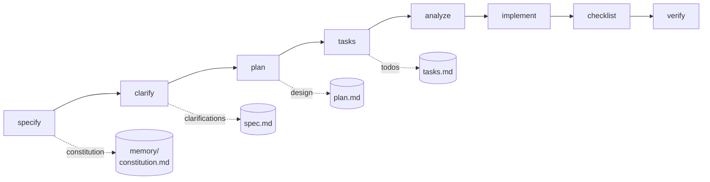
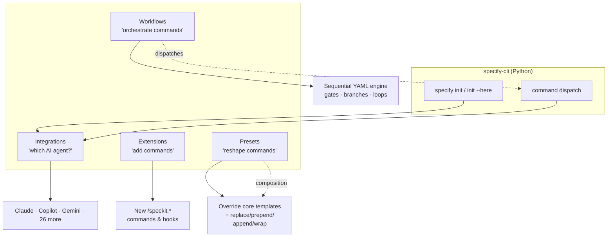
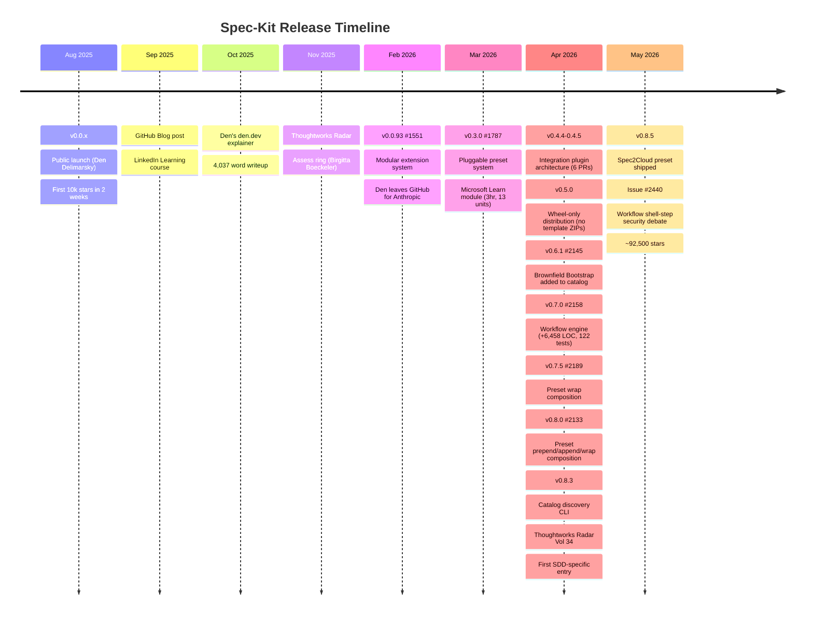

# Spec‑Kit: New Developments, Fleet Extension, Presets, Extensions & Workflows — A Deep Research Report

<!-- markdownlint-disable -->

> **Scope.** This report consolidates findings from 8 parallel research investigations into `github/spec-kit` and its ecosystem (HEAD SHA `0d8685aa80e2c1e9c18f83f661e23e2c7c64250a`, latest stable v0.8.5, ~92k★). It covers the project's philosophy, the four pluggable pillars (**Integrations · Extensions · Presets · Workflows**), the [Fleet](https://github.com/sharathsatish/spec-kit-fleet) and other notable extensions, the new workflow engine (PR [#2158](https://github.com/github/spec-kit/pull/2158)), the [NASA Hermes brownfield demo](https://github.com/mnriem/spec-kit-go-brownfield-demo), and the chronological release history from launch (Aug 2025) through May 2026.
>
> **Pinned references.** Where possible, GitHub URLs include commit SHAs so links remain stable as the codebase evolves.

---

## Table of Contents

1. [Executive Summary](#1-executive-summary)
2. [What Spec‑Kit Is (and Why It Exists)](#2-what-spec-kit-is-and-why-it-exists)
3. [The Architecture — Four Pluggable Pillars](#3-the-architecture--four-pluggable-pillars)
4. [Pillar 1 — Integrations (29 AI agents)](#4-pillar-1--integrations-29-ai-agents)
5. [Pillar 2 — Extensions (60+ community)](#5-pillar-2--extensions-60-community)
6. [Pillar 3 — Presets (18 community + 3 bundled)](#6-pillar-3--presets-18-community--3-bundled)
7. [Pillar 4 — Workflows (the new declarative engine)](#7-pillar-4--workflows-the-new-declarative-engine)
8. [The Fleet Orchestrator — Deep Dive](#8-the-fleet-orchestrator--deep-dive)
9. [Brownfield Development — Demo Walkthrough & Lessons](#9-brownfield-development--demo-walkthrough--lessons)
10. [Recent Developments — Chronological Timeline (Aug 2025 → May 2026)](#10-recent-developments--chronological-timeline-aug-2025--may-2026)
11. [Official Narratives & External Coverage](#11-official-narratives--external-coverage)
12. [Key Repositories Summary](#12-key-repositories-summary)
13. [Confidence Assessment & Gaps](#13-confidence-assessment--gaps)
14. [References](#14-references)

---

## 1. Executive Summary

**Spec‑Kit** is GitHub's open‑source Spec‑Driven Development (SDD) toolkit. It treats specifications — not code — as the primary artifact, then drives AI coding agents through a structured pipeline (`specify → clarify → plan → tasks → analyze → implement → checklist`). Launched **September 2, 2025** by Den Delimarsky (who has since left for Anthropic; **Manfred Riem / `mnriem`** is now the primary maintainer), the repo grew to **~92k★** within nine months.

Between January and May 2026 the project graduated from a single template generator into a **plugin platform** with four orthogonal pillars:

| Pillar | What it does | Introduced |
|---|---|---|
| **Integrations** | Plugin per AI agent (29 today: Copilot, Claude, Gemini, Cursor, Windsurf, Codex, Goose, Forge, Qwen, Devin, Kimi, Vibe, Agy, …) | v0.4.4 / Apr 2026 |
| **Extensions** | Add new commands/templates/scripts/hooks (Brownfield, Spec2Cloud, Verify, AIDE, Memory Hub, Squad Bridge, Fleet, …) | v0.0.93 / Feb 2026 |
| **Presets** | Reshape the *core* templates and commands themselves (Azure, a11y, security, iSAQB, fiction, screenwriting, …) | v0.3.0 / Mar 2026, composition v0.8.0 |
| **Workflows** | Declarative YAML pipelines with gates, branches, loops, fan‑out/fan‑in | v0.7.0 / Apr 2026 (PR [#2158](https://github.com/github/spec-kit/pull/2158)) |

**The Fleet extension** ([`sharathsatish/spec-kit-fleet`](https://github.com/sharathsatish/spec-kit-fleet)) is a single super‑command — `/speckit.fleet.run` — that chains all 10 SDD phases with mandatory human gates, parallel‑task dispatch, and a deliberately *cross‑model* review step (Phase 7) to catch the generating model's blind spots.

**The brownfield demo** ([`mnriem/spec-kit-go-brownfield-demo`](https://github.com/mnriem/spec-kit-go-brownfield-demo)) shows Spec‑Kit retrofitting a real 98K‑LOC NASA ground‑support codebase (Hermes) into a working telemetry dashboard. The demo's lessons are explicit: **the artifacts you give the agent determine the implementation quality.** Skipping `speckit.clarify` and `speckit.analyze` produced a CORS bug, four restart attempts, and the need to enable YOLO mode — all avoidable with a few extra minutes of upfront work.

---

## 2. What Spec‑Kit Is (and Why It Exists)

### 2.1 The Origin Story

Spec‑Kit was conceived by **John Lam** (Microsoft/GitHub researcher) and prototyped by **Den Delimarsky** as Principal PM at GitHub. From Den's personal write‑up [^den-blog]:

> *"It's a project born out of [John Lam's](https://notes.iunknown.com/About) research in how to help steer the software development process with Large Language Models (LLMs) and make it just a tiny bit more deterministic."*

> *"GitHub Spec Kit is, at its core, **not a product**. That's the fun part about working on this project — it's an experiment designed to test how well the methodologies behind SDD actually work."*

The initial GitHub Blog post (Sep 2, 2025) framed it as a re‑think of what specifications are [^github-blog]:

> *"That's why we're rethinking specifications — not as static documents, but as living, executable artifacts that evolve with the project. Specs become the shared source of truth."*

> *"We're moving from 'code is the source of truth' to 'intent is the source of truth.'"*

### 2.2 The Manifesto: `spec-driven.md`

The repo ships a 25 KB manifesto, [`spec-driven.md`](https://github.com/github/spec-kit/blob/main/spec-driven.md) (last edited by Den, then extended by community PRs) [^manifesto]:

> *"Spec‑Driven Development (SDD) inverts this power structure. Specifications don't serve code — code serves specifications."*

> *"Debugging means fixing specifications and their implementation plans that generate incorrect code."*

Six **core principles** drive the project:

1. **Specifications as the Lingua Franca** — the universal medium that bridges human intent and machine execution
2. **Executable Specifications** — specs aren't documents; they generate code
3. **Continuous Refinement** — specs evolve with the project
4. **Research‑Driven Context** — agents pull in evidence; templates discourage hallucination
5. **Bidirectional Feedback** — code informs spec, spec informs code
6. **Branching for Exploration** — every spec gets its own git branch

The manifesto frames the time savings explicitly:

```
Traditional: ~12 hours of documentation work
SDD with Commands: ~15 minutes (specify + plan + tasks)
```

### 2.3 The Core Command Pipeline



Every command writes a Markdown artifact under `specs/{NNN-feature}/`, plus optional JSON sidecars (`tasks.json`) for machine consumption. The artifacts are designed to be **diff‑able and reviewable**, not generated black boxes.

---

## 3. The Architecture — Four Pluggable Pillars



The pillars are **orthogonal but composable**: Spec2Cloud, for example, ships *all four* artifacts in one repo (a preset that reshapes the templates for Azure, an extension that adds `verify`/`deploy` commands, and a workflow that chains them, dispatched through the user's chosen integration).

---

## 4. Pillar 1 — Integrations (29 AI Agents)

**Stage 1‑6 plugin architecture** landed in v0.4.4‑v0.4.5 (PRs [#1925](https://github.com/github/spec-kit/pull/1925), [#2035](https://github.com/github/spec-kit/pull/2035), [#2038](https://github.com/github/spec-kit/pull/2038), [#2050](https://github.com/github/spec-kit/pull/2050), [#2052](https://github.com/github/spec-kit/pull/2052), [#2063](https://github.com/github/spec-kit/pull/2063)) on Apr 1‑2, 2026.

Each integration is a Python class implementing a small, well‑defined interface — `build_exec_args()`, `dispatch_command()`, `build_command_filename()`, etc. Integrations live in `src/specify_cli/integrations/` and register themselves at import time.

| Category | Integrations |
|---|---|
| **Native CLI dispatch** (markdown slash commands) | `claude`, `copilot`, `gemini`, `codex`, `qwen`, `goose`, `forge`, `kimi`, `vibe`, `agy` |
| **Skills‑based** (filesystem skills folder) | `claude` (skills mode), `copilot` (skills mode) |
| **IDE‑only** (no CLI dispatch) | `cursor`, `windsurf`, `cline`, `roo`, `kilo`, `opencode`, `aider`, `auggie`, `voidide`, `q-cli`, `zed`, `void` |
| **Cloud‑hosted** | `devin`, `replit-agent`, `bolt`, `phind`, `lovable`, `e2b` |

State is persisted in `.specify/integration.json`:

```json
{
  "version": "0.8.0",
  "integration_state_schema": 1,
  "default_integration": "claude",
  "installed_integrations": ["claude", "copilot"],
  "integration_settings": {
    "claude": { "script": "skills", "raw_options": "--model claude-sonnet-4" }
  }
}
```

Discovery is exposed via a **catalog** (PR [#2360](https://github.com/github/spec-kit/pull/2360)): `specify integration search`, `specify integration info <id>`, `specify integration catalog list/add/remove`.

---

## 5. Pillar 2 — Extensions (60+ Community)

**Modular extension system** landed in v0.0.93 (PR [#1551](https://github.com/github/spec-kit/pull/1551), Feb 10, 2026). An extension is a directory with:

```
my-extension/
├── extension.yml           # metadata, requires, provides, hooks
├── commands/               # /speckit.* command files (markdown)
├── templates/              # spec/plan/tasks template overrides
├── scripts/{bash,powershell}/
└── README.md
```

Extensions are installed via `specify extension add <id>` (from the curated `catalog.community.json`) or `specify extension add --from <URL or zip>`.

### 5.1 The Five Hook Points

Extensions can register hooks that fire on lifecycle events:

| Hook | When it fires | Example consumer |
|---|---|---|
| `after_init` | After `specify init` completes | Brownfield Bootstrap (auto‑scan codebase) |
| `before_plan` | Before `speckit.plan` runs | Memory Hub (inject prior context) |
| `after_specify` | After `speckit.specify` writes spec.md | Squad Bridge (regenerate agent roster) |
| `after_tasks` | After `speckit.tasks` writes tasks.md | Squad Bridge (auto‑route tasks to agents) |
| `after_implement` | After `speckit.implement` finishes | Verify (post‑impl quality gate) · Memory Hub (capture lessons from diff) |

### 5.2 Notable Extensions

#### Brownfield Bootstrap — `Quratulain-bilal/spec-kit-brownfield`
Replaces `specify init --here` placeholder templates with intelligence derived from the actual codebase. Four commands [^brownfield-ext]:

- **`/speckit.brownfield.scan`** — read‑only Project Profile (tech stack, architecture, conventions, monorepo detection)
- **`/speckit.brownfield.bootstrap`** — generates a tailored constitution + templates from the scan
- **`/speckit.brownfield.validate`** — drift detection between the bootstrap output and reality
- **`/speckit.brownfield.migrate`** — reverse‑engineers `spec.md`/`plan.md`/`tasks.md` for features built before SDD adoption

The `after_init` hook makes this seamless: `specify init` triggers a "Scan this existing project?" prompt before any templates are written. Added to the official community catalog in v0.6.1 / PR [#2145](https://github.com/github/spec-kit/pull/2145).

#### Spec2Cloud — `Azure-Samples/Spec2Cloud`
The first **multi‑artifact** extension (and the canonical example of "extension + preset + workflow in one repo"):

| Artifact | Purpose |
|---|---|
| Extension v1.1.0 | Adds `/speckit.spec2cloud.verify` and `/speckit.spec2cloud.deploy` commands |
| Preset v1.1.0 | Overrides 8 core commands + 5 templates with Azure‑aware variants |
| Workflow v1.1.0 | `constitution → specify → clarify → plan → tasks → implement → verify → deploy` with gates |

IaC priority: `azure.yaml` → `infra/main.bicep` → `main.bicep` → `infra/main.tf`. Local verification provisions Azurite, the Cosmos DB Emulator, and `az containerapp` locally before running acceptance scenarios.

#### Verify — `ismaelJimenez/spec-kit-verify`
Read‑only post‑implementation quality gate. Single command `speckit.verify.run` runs **7 checks** (Task Completion, File Existence, Requirement Coverage, Scenario & Test Coverage, Spec Intent Alignment, Constitution Alignment, Design & Structure Consistency) producing a `max_findings`‑capped report with stable severity IDs (CRITICAL/HIGH/MEDIUM/LOW). Fleet Phase 9 wraps it in a 3‑iteration Implement→Verify loop on CRITICAL findings.

#### AIDE — `mnriem/spec-kit-extensions/aide/`
"AI‑Driven Engineering" — a **7‑command artifact‑first greenfield workflow** that rejects the linear `specify → plan → tasks` flow in favor of:

```
create-vision → create-roadmap → create-progress → create-queue
   → create-item (×N) → execute-item (×N) → feedback-loop (anytime)
```

The `feedback-loop` command is a reflective retrospective callable at *any* step, capable of refining the process itself. Demo: `mnriem/spec-kit-aide-extension-demo` builds a Spring Boot 4 + React 19 + PostgreSQL trading platform from scratch.

#### Memory Hub — `DyanGalih/spec-kit-memory-hub` (extension ID: `memory-md`)
Repository‑native Markdown memory system. Six commands: `bootstrap`, `plan-with-memory` (fires on `before_plan`), `capture`, `capture-from-diff` (fires on `after_implement`), `audit`, `log-finding`. Creates an ever‑improving context loop — memory read before plan, written after implement.

#### Squad Bridge — `jwill824/spec-kit-squad`
Bridges Spec‑Kit artifacts to Brady Gaster's [Squad CLI](https://bradygaster.github.io/squad/) (multi‑agent team manager). Four commands: `init`, `generate`, `route`, `status`. `after_specify` regenerates agent definitions; `after_tasks` auto‑routes work via `capability-match`. Supports model tiers (`complex` → opus, `standard` → sonnet, `simple` → haiku).

#### Fleet Orchestrator — `sharathsatish/spec-kit-fleet`
Single super‑command that chains all 10 SDD phases with mandatory human gates. **See §8 for full deep‑dive.**

---

## 6. Pillar 3 — Presets (18 Community + 3 Bundled)

Where extensions *add* commands, **presets reshape the core ones**. A preset replaces the contents of `speckit.specify`, `speckit.plan`, `speckit.tasks`, etc., with domain‑specific variants. Pluggable preset system landed in **v0.3.0 / PR [#1787](https://github.com/github/spec-kit/pull/1787)** (Mar 13, 2026); composition strategies arrived in v0.7.5 (PR [#2189](https://github.com/github/spec-kit/pull/2189)) and v0.8.0 (PR [#2133](https://github.com/github/spec-kit/pull/2133)).

### 6.1 Composition Strategies

| Strategy | Behavior | Notes |
|---|---|---|
| `replace` (default) | Preset content fully replaces core | Simplest — like the original v0.3.0 model |
| `prepend` | Preset content appears **before** core | E.g. add governance section atop core spec template |
| `append` | Preset content appears **after** core | E.g. add a security checklist to the end of plan |
| `wrap` | Preset embeds core via `{CORE_TEMPLATE}` placeholder (templates/commands) or `$CORE_SCRIPT` (scripts) | Most flexible — full control over framing |

The 5‑tier resolution stack (highest → lowest priority):

```
1. Project overrides       (.specify/templates/...)
2. Installed presets        (sorted by preset.priority, default 50)
3. Extensions               (templates/ folder)
4. Core templates on disk   (.specify/templates/ defaults)
5. Bundled wheel core pack  (templates baked into specify-cli)
```

### 6.2 Bundled Presets (ship inside specify‑cli)

| Preset | Purpose |
|---|---|
| **`lean`** | Minimal 5‑command preset — strips checklists, analyze, clarify; just specify/plan/tasks/implement/constitution |
| **`scaffold`** | Authoring template for new presets — copy this and edit |
| **`self-test`** | CI testing of the preset system itself |

### 6.3 Community Preset Catalog (18 entries as of May 2026)

| Preset | Author | Domain |
|---|---|---|
| `a11y-governance` | hindermath | Accessibility (WCAG, ARIA, screen-reader testing) |
| `architecture-governance` | hindermath | C4 model, ADRs, fitness functions |
| `security-governance` | hindermath | Threat modeling, OWASP checks, secret scanning |
| `cross-platform-governance` | hindermath | Multi‑OS / multi‑arch concerns |
| `isaqb-governance` | hindermath | iSAQB Foundation Level architecture standards |
| `agent-parity-governance` | hindermath | Cross‑model output comparison |
| `spec2cloud` | Azure‑Samples | Azure Container Apps + Cosmos DB + Bicep |
| `fiction-book-writing` | Andreas Daumann | 22 templates, 27 commands for novel writing |
| `screenwriting` | Andreas Daumann | 26 templates, 32 commands for film/TV scripts |
| `pirate` | luno | 🏴‍☠️ Pirate‑voice spec writing (humor, but a real preset) |
| `jira` | luno | Jira‑style story format and acceptance criteria |
| `multi-repo-branching` | community | Coordinate specs across N repositories |
| `canon-core` | community | Library/SDK authoring standards |
| `aide-in-place` | community | AIDE workflow without the AIDE extension |
| `claude-ask-questions` | community | Force Claude to ask clarifying questions before writing |
| `vscode-ask-questions` | community | Same, but for Copilot in VS Code |
| `explicit-task-dependencies` | community | Adds explicit DAG syntax to tasks.md |
| `toc-navigation` | community | Auto‑generates ToC for all generated docs |

The community preset catalog grew from **2 → 12 entries in April 2026 alone** [^april-newsletter].

---

## 7. Pillar 4 — Workflows (the New Declarative Engine)

Introduced in **v0.7.0 / PR [#2158](https://github.com/github/spec-kit/pull/2158)** (merged 2026‑04‑14, +6,458 LOC across 34 files, 122 new tests). Where Fleet is a single super‑command driven by an AI agent's prompt loop, Workflows are a **declarative, sequential, resumable YAML engine** that runs in the CLI itself.

### 7.1 State Machine

```
CREATED → RUNNING → COMPLETED
                 → PAUSED   (gate hit; resume() → RUNNING)
                 → FAILED   (step error; resume() → RUNNING)
                 → ABORTED  (gate reject + on_reject: abort)
```

State persists under `.specify/workflows/runs/{run_id}/`:

| File | Purpose |
|---|---|
| `state.json` | Status, current step, completed step results |
| `inputs.json` | Resolved input values |
| `log.jsonl` | Append‑only step transitions |
| `workflow.yml` (copy) | Frozen at run start so source edits don't break resume |

### 7.2 The Bundled `speckit` Workflow

[`workflows/speckit/workflow.yml`](https://github.com/github/spec-kit/blob/0d8685aa80e2c1e9c18f83f661e23e2c7c64250a/workflows/speckit/workflow.yml) (file SHA `bf18451029e514ba10811af9adf3a502c39050a9`):

```yaml
schema_version: "1.0"
workflow:
  id: "speckit"
  name: "Full SDD Cycle"
  version: "1.0.0"
  author: "GitHub"
  description: "Runs specify → plan → tasks → implement with review gates"

requires:
  speckit_version: ">=0.7.2"
  integrations:
    any: ["copilot", "claude", "gemini"]

inputs:
  spec:        { type: string, required: true,  prompt: "Describe what you want to build" }
  integration: { type: string, default: "copilot" }
  scope:       { type: string, default: "full", enum: ["full", "backend-only", "frontend-only"] }

steps:
  - id: specify
    command: speckit.specify
    integration: "{{ inputs.integration }}"
    input: { args: "{{ inputs.spec }}" }

  - id: review-spec
    type: gate
    message: "Review the generated spec before planning."
    options: [approve, reject]
    on_reject: abort

  - id: plan
    command: speckit.plan
    integration: "{{ inputs.integration }}"
    input: { args: "{{ inputs.spec }}" }

  - id: review-plan
    type: gate
    message: "Review the plan before generating tasks."
    options: [approve, reject]
    on_reject: abort

  - id: tasks
    command: speckit.tasks
    integration: "{{ inputs.integration }}"
    input: { args: "{{ inputs.spec }}" }

  - id: implement
    command: speckit.implement
    integration: "{{ inputs.integration }}"
    input: { args: "{{ inputs.spec }}" }
```

### 7.3 The 10 Step Types

| Type | Purpose | Key fields |
|---|---|---|
| `command` (default) | Dispatch a `speckit.*` command via an integration | `command`, `integration`, `model`, `options`, `input.args` |
| `gate` | Interactive approval; PAUSED in non‑TTY | `message`, `options`, `on_reject: abort\|skip\|retry` |
| `shell` | Local shell command (5‑min timeout) | `run` (subprocess `shell=True`) |
| `prompt` | Inline AI prompt (no command file) | `prompt`, `integration`, `model` |
| `if` | Conditional branch | `condition`, `then`, `else` |
| `switch` | Multi‑branch dispatch | `expression`, `cases`, `default` |
| `while` | Conditional loop | `condition`, `max_iterations`, `steps` |
| `do-while` | At‑least‑once loop | `condition`, `max_iterations`, `steps` |
| `fan-out` | Per‑item dispatch (sequential v1; concurrency planned) | `items`, `step` template |
| `fan-in` | Aggregate fan‑out results | `wait_for: [step_ids]` |

### 7.4 Sandboxed Expression Engine

Expressions use `{{ }}` Jinja‑like syntax (see [`expressions.py`](https://github.com/github/spec-kit/blob/0d8685aa80e2c1e9c18f83f661e23e2c7c64250a/src/specify_cli/workflows/expressions.py)). Available namespaces: `inputs`, `steps` (accumulated outputs), `item` (in fan‑out), `fan_in` (in fan‑in). Supported operations include `==`, `!=`, `>`, `<`, `and`, `or`, `not`, `in`, list indexing, and filters: `default()`, `join()`, `contains()`, `map()`. **No file I/O, no imports, no `eval()`** — all sandboxed.

### 7.5 CLI Commands

```bash
specify workflow add speckit                       # install from catalog
specify workflow add my-flow --from <URL>          # from URL
specify workflow run speckit --input spec="..."   # run
specify workflow run ./workflow.yml --input ...   # run local file
specify workflow resume <run_id>                   # resume PAUSED/FAILED
specify workflow status [run_id]                   # check runs
specify workflow list                              # installed workflows
specify workflow info speckit                      # validate + show steps
specify workflow remove speckit
specify workflow search [query]
specify workflow catalog list/add/remove
```

### 7.6 Catalogs

| File | Purpose | install_allowed |
|---|---|---|
| `workflows/catalog.json` | Default GitHub catalog (currently `speckit` only) | ✅ yes |
| `workflows/catalog.community.json` | Community‑submitted workflows | ❌ no (discovery only — install requires explicit `--from <URL>`) |

Catalogs use **1‑hour TTL caching** with SHA256‑hashed cache files under `.specify/workflows/.cache/`.

### 7.7 The Open Security Concern: Issue #2440

[Issue #2440](https://github.com/github/spec-kit/issues/2440) — *"[Security hardening] Require explicit opt‑in for workflow shell steps"* (still open as of HEAD).

Currently `ShellStep` runs commands with `subprocess.run(shell=True, timeout=300)` — full shell with pipes/redirects. Contributor `PascalThuet` proposed a `requires.permissions.shell: true` field with explicit user opt‑in for downloaded workflows. Maintainer `mnriem` declined:

> *"This is why the community catalog is read‑only and thus requires anyone to look at the code and see what it does. I would like to keep the core simple and not add this complexity to this particular step."* — `mnriem`, 2026‑05‑04

The current mitigation is `install_allowed=false` on the community catalog, forcing `--from <URL>` and a manual review.

### 7.8 Workflows vs. Fleet — When to Use Which

| Dimension | Workflow Engine | Fleet Orchestrator |
|---|---|---|
| **Definition** | Declarative YAML | Single CLI invocation |
| **Execution** | Sequential CLI engine | Conversational AI loop |
| **State persistence** | Yes — JSON under `.specify/workflows/runs/` | No — session‑scoped |
| **Resume** | Yes (`specify workflow resume`) | No |
| **Human gates** | Explicit `gate` step type | Conversational turn‑taking |
| **Control flow** | `if`/`switch`/`while`/`fan-out`/`fan-in` | Agent decides internally |
| **Catalog** | Yes (`catalog.json` + `catalog.community.json`) | No |
| **Use case** | Repeatable, auditable team pipelines | Exploratory, agent‑led sessions |

---

## 8. The Fleet Orchestrator — Deep Dive

### 8.1 What Fleet Is

[`sharathsatish/spec-kit-fleet`](https://github.com/sharathsatish/spec-kit-fleet) v1.1.0 is an extension that adds a single command: **`/speckit.fleet.run`**. That command executes all 10 SDD phases in sequence, with a mandatory human gate between each phase, and a deliberate cross‑model review at Phase 7.

The `commands/fleet.md` file is **30,855 bytes** of detailed phase logic (commit SHA `e75e9cab25bdf07d7442be1073b7d24179239b49` of [`commands/fleet.md`](https://github.com/sharathsatish/spec-kit-fleet/blob/ac33e1e339fbf87abd0948c60029e5c960589259/commands/fleet.md)).

### 8.2 The 10 Phases

| # | Phase | Sub‑agent invoked | Artifact signal | Gate |
|---|---|---|---|---|
| 1 | **Specify** | `speckit.specify` | `spec.md` exists, has `## User Stories` or `## Requirements`, >100 bytes | User approves |
| 2 | **Clarify** | `speckit.clarify` | `spec.md` contains `## Clarifications` with ≥1 Q&A | User says "done" or loops |
| 3 | **Plan** | `speckit.plan` | `plan.md` exists, has `## Architecture` or `## Tech Stack`, >200 bytes | User approves |
| 4 | **Checklist** | `speckit.checklist` | `checklists/` directory has ≥1 file | User approves |
| 5 | **Tasks** | `speckit.tasks` | `tasks.md` has `- [ ]`/`- [x]` items + `### Phase` heading | User approves |
| 6 | **Analyze** | `speckit.analyze` | `.analyze-done` marker file | User acknowledges |
| 7 | **Cross‑Model Review** | `speckit.fleet.review` (different model) | `review.md` has `## Summary` + verdict table | User acks; FAIL items resolved |
| 8 | **Implement** | `speckit.implement` | All `- [x]`, zero `- [ ]` in tasks.md | Implementation complete |
| 9 | **Verify** | `speckit.verify` | `.verify-done` marker (CRITICAL findings = 0) | User acknowledges |
| 10 | **Tests** | Terminal test runner | Test runner detected and run | Tests pass |

### 8.3 Resume Logic

Fleet auto‑detects progress from artifacts:

```
if spec.md missing            → Phase 1
if no ## Clarifications       → Phase 2
if plan.md missing            → Phase 3
if checklists/ empty/missing  → Phase 4
if tasks.md missing           → Phase 5
if .analyze-done missing      → Phase 6
if review.md missing          → Phase 7
if tasks.md has `- [ ]`       → Phase 8
if .verify-done missing       → Phase 9
else                          → Phase 10
```

Status table shown to the user before resuming:

```
Phase 1 Specify      [x] spec.md found
Phase 2 Clarify      [x] ## Clarifications present
Phase 3 Plan         [x] plan.md found
Phase 4 Checklist    [ ] --
...
> Resuming at Phase 4: Checklist
```

### 8.4 The Six Operating Rules

1. **One phase at a time.** Never skip ahead or run phases in parallel.
2. **Human gate menu every phase:** Approve / Revise / Skip / Abort / Rollback. *"CRITICAL: Never end a turn without presenting this menu."*
3. **Suppress sub‑agent handoffs:** Each sub‑agent prompt prepends *"Do NOT follow handoffs or auto‑forward to other agents. Return output to orchestrator and stop."* This blocks the `plan → tasks → analyze → implement` auto‑chaining that would bypass gates.
4. **Context budget compaction:** After each approved phase, distill output to a 1‑2 sentence summary + artifact paths. Discard the full sub‑agent response from working memory. Starting at Phase 5, suggest fresh‑chat resume if context pressure is high.
5. **One question per turn:** WIP commit offer and gate menu are always sequential, never combined.
6. **Git checkpoints offered (never auto‑committed)** after Phase 5, 8, and 9. Format: `wip: fleet phase {N} -- {phase name} complete`.

### 8.5 The Cross‑Model Review (Phase 7) — Fleet's Signature Mechanism

Fleet's most distinctive design is Phase 7. It deliberately invokes `speckit.fleet.review` with a **different model than the one that generated the artifacts**, to catch the generator's blind spots. From [`commands/review.md`](https://github.com/sharathsatish/spec-kit-fleet/blob/ac33e1e339fbf87abd0948c60029e5c960589259/commands/review.md):

> *"Pre‑Implementation Reviewer — a critical evaluator who reviews design artifacts produced by earlier workflow phases. Purpose: catch issues the generating model may have been blind to."*

**Seven review dimensions** (each PASS / WARN / FAIL):

| # | Dimension | Key checks |
|---|---|---|
| 1 | Spec‑Plan Alignment | plan.md addresses every user story? NFRs (perf/sec/a11y) covered? |
| 2 | Plan‑Tasks Completeness | Every architectural component has tasks? Test tasks for critical paths? |
| 3 | Dependency Ordering | Phases ordered correctly (setup → foundational → stories → polish)? |
| 4 | Parallelization Correctness | `[P]` markers accurate? Same‑file conflicts hidden in parallel groups? Max‑3 respected? |
| 5 | Feasibility & Risk | Tasks touching >3 files or >200 LOC flagged; tech choices vs. existing stack |
| 6 | Constitution & Standards | Aligns with `.specify/memory/constitution.md`; coverage / TDD requirements; security |
| 7 | Implementation Readiness | Every task specific enough for LLM execution; exact file paths; clear acceptance criteria |

Output:

```markdown
# Pre-Implementation Review
**Review model**: {model name — must differ from generating model}
| Dimension | Verdict | Issues |
Overall: READY / READY WITH WARNINGS / NOT READY
## Findings: Critical / Warnings / Observations
## Recommended Actions
```

### 8.6 Parallelism (Phases 3 & 8)

Up to **3 sub‑agents dispatched simultaneously** for `[P]`‑marked tasks:

```markdown
<!-- parallel-group: 1 (max 3 concurrent) -->
- [ ] T002 [P] Create ModelA.cs
- [ ] T003 [P] Create ModelB.cs
- [ ] T004 [P] Create ModelC.cs

<!-- sequential -->
- [ ] T005 Create service that depends on all models
```

Constraints: same‑file tasks always sequential; phase boundaries are serial; human gate after each implementation phase.

### 8.7 The Implement‑Verify Loop (Phase 9)

```
repeat:
  1. Present findings
  2. Ask: "Re-run implementation to address? (yes/skip/abort)"
  3. If yes → speckit.implement with findings → re-run speckit.verify
  4. After re-verify, show delta: "Fixed: N, New: N, Remaining: N"
until: no findings OR user says skip/abort
Cap: 3 iterations, then warn about manual intervention
```

Same structure for the Phase 10 CI Remediation Loop (test failures).

### 8.8 Fleet vs. Workflow — Same Goal, Different Surface

Both deliver "run all the SDD phases automatically with checkpoints," but:

- **Workflow engine** is for teams that want **reproducible, version‑controlled, resumable pipelines** runnable in CI. The pipeline is YAML — code review it, tag releases, share across teams.
- **Fleet** is for **interactive sessions** where you want the AI to drive but with mandatory checkpoints. It's prompt‑native — runs inside the agent's chat, not as a separate CLI process.

Spec‑Kit's authors do not consider these competing — they're complementary, and many users will run Fleet to *develop* a workflow YAML they later promote to a team's catalog.

---

## 9. Brownfield Development — Demo Walkthrough & Lessons

### 9.1 The Demo Project

[`mnriem/spec-kit-go-brownfield-demo`](https://github.com/mnriem/go-brownfield-demo) shows Spec‑Kit running on **NASA Hermes** — a real ground‑support telemetry system, **~98K LOC of Go + TypeScript**, no prior Spec‑Kit constitution, no specs, no design docs. The goal: deliver a working web‑based telemetry dashboard entirely through agent‑driven workflows.

The repo is small (3 squashed commits) but instructive. Tools used:

- Spec‑Kit **v0.1.14** (note: pre‑plugin era — far older than current v0.8.5)
- GitHub Copilot CLI as the AI agent
- `specify init --here` as the entry point

### 9.2 The Walkthrough (verbatim from `WORKSHOP.md`)

```
1. specify init --here --force --integration copilot
2. /speckit.constitution             ← (skipped customization; template committed unfilled)
3. /speckit.specify "telemetry dashboard..."
4. /speckit.plan                      ← invoked 4 times; agent kept restarting
5. /speckit.tasks
6. /speckit.implement                 ← required --yolo flag (allow all tools)
   → CORS bug surfaced
7. Manual fix to pkg/dashboard/handler.go (websocket.Server origin override)
8. Verification: telemetry dashboard runs end-to-end
```

**Skipped steps (per the retrospective):** `/speckit.clarify` and `/speckit.analyze` were both deliberately omitted to "see what happens." The author was explicit that this was a demonstration of skipping investment, not a recommendation.

### 9.3 The Three Rough Edges

1. **The CORS bug.** Root cause: `golang.org/x/net/websocket` Server does an origin check by default. Fix in [`pkg/dashboard/handler.go:34-35`](https://github.com/mnriem/spec-kit-go-brownfield-demo/blob/main/pkg/dashboard/handler.go) — wrap the handler with `websocket.Server{Handler: ws}` (the empty `Server{}` skips same‑origin enforcement). The agent did *not* catch this in advance because no NFR for "browser cross‑origin access" appeared in `spec.md`. A `/speckit.clarify` pass would almost certainly have surfaced this.

2. **The four restart attempts.** `/speckit.plan` was invoked four times before producing a usable plan. The agent kept losing context mid‑generation because the spec was thin and there was no `clarify` output to anchor decisions. Skipping `/speckit.analyze` meant nothing surfaced the missing context until the plan attempts were already failing.

3. **YOLO mode.** The default `specify implement` workflow asks for confirmation on every shell command. The user enabled `--yolo` (Copilot CLI's flag, forwarded by `SPECKIT_COPILOT_ALLOW_ALL_TOOLS=true`) to skip the prompts. PR [#2298](https://github.com/github/spec-kit/pull/2298) (v0.7.4, 2026) made this the default for Copilot to reduce friction — but the brownfield demo predates that change.

### 9.4 The Lesson (in the author's own words)

The demo's `WORKSHOP.md` retrospective is candid:

> *"None of these are failures of the tooling — they are the natural consequence of moving fast and skipping steps that exist precisely to catch these problems early. The more interesting takeaway is the ceiling, not the floor. Even with a thin spec, a bare plan, and no analysis pass, the agents produced a running, end‑to‑end implementation that required only conversational follow‑up to debug and verify."*

> *"For teams considering this workflow: the agents are only as good as the context you give them. Treat speckit.specify, speckit.plan, and speckit.analyze as investments, not formalities. The implementation will reflect the quality of the artifacts that precede it."*

### 9.5 The Brownfield Trinity

For new‑to‑Spec‑Kit teams onboarding existing codebases, the recommended path today (as of v0.8.5) is:

```bash
# 1. Init in place
specify init --here --integration copilot

# 2. Install Brownfield Bootstrap (closes the gap from generic templates → codebase-aware)
specify extension add brownfield --from https://github.com/Quratulain-bilal/spec-kit-brownfield/archive/refs/tags/v1.0.0.zip

# 3. Scan and bootstrap (after_init hook prompts you automatically)
/speckit.brownfield.scan
/speckit.brownfield.bootstrap        # generates constitution + templates from real code
/speckit.brownfield.validate         # drift check
/speckit.brownfield.migrate "auth"   # reverse-engineer existing features

# 4. (Optional) Install Memory Hub for persistent project memory
specify extension add memory-md --from https://github.com/DyanGalih/spec-kit-memory-hub

# 5. (Optional) Install Fleet for end-to-end orchestration
specify extension add fleet --from https://github.com/sharathsatish/spec-kit-fleet

# Now drive features with the standard cycle, augmented by brownfield context
/speckit.specify "..."
/speckit.clarify
/speckit.plan
/speckit.tasks
/speckit.analyze    # don't skip this!
/speckit.implement
```

---

## 10. Recent Developments — Chronological Timeline (Aug 2025 → May 2026)



### 10.1 Phase 1: Public Launch (Aug–Nov 2025)

- **v0.0.1 (Aug 25, 2025).** Initial release. Just templates + a Python CLI. Den Delimarsky published the GitHub Blog post on Sep 2.
- **Sep 11, 2025.** LinkedIn Learning course (Morten Rand‑Hendriksen, 47 min) — first major external endorsement.
- **Oct 12, 2025.** Den's personal explainer on den.dev — the most detailed inside view of the project.
- **Nov 2025.** Thoughtworks Radar enters the project at "Assess" with reservations: *"We may be relearning a bitter lesson — that handcrafting detailed rules for AI ultimately doesn't scale."*

### 10.2 Phase 2: Extension System (Feb 2026)

- **v0.0.93 / PR #1551 (Feb 10, 2026).** First plugin point. Extensions can register commands, templates, scripts, and hooks. Catalog system introduced.

### 10.3 Phase 3: Preset System (Mar 2026)

- **v0.3.0 / PR #1787 (Mar 13, 2026).** Presets reshape the *core* commands and templates. Initially `replace`‑only.
- **March newsletter** documents the first community presets (a11y‑governance, fiction‑book‑writing).

### 10.4 Phase 4: Integration Architecture (Early Apr 2026)

Six PRs landed in 2 days:

| PR | Date | Stage |
|---|---|---|
| [#1925](https://github.com/github/spec-kit/pull/1925) | Apr 1 | Stage 1: Plugin loader skeleton |
| [#2035](https://github.com/github/spec-kit/pull/2035) | Apr 1 | Stage 2: `IntegrationBase` interface |
| [#2038](https://github.com/github/spec-kit/pull/2038) | Apr 2 | Stage 3: Per‑integration command dispatch |
| [#2050](https://github.com/github/spec-kit/pull/2050) | Apr 2 | Stage 4: Skills mode for Claude/Copilot |
| [#2052](https://github.com/github/spec-kit/pull/2052) | Apr 2 | Stage 5: Cloud‑hosted integrations |
| [#2063](https://github.com/github/spec-kit/pull/2063) | Apr 2 | Stage 6: IDE‑only integration surface |

This was the inflection point — before April, Spec‑Kit was effectively Claude/Copilot/Gemini only. After, **29 integrations** were available.

### 10.5 Phase 5: Workflow Engine (Mid Apr 2026)

- **v0.6.1 / PR #2145 (Apr 10, 2026).** Brownfield Bootstrap added to the official community catalog.
- **v0.7.0 / PR #2158 (Apr 14, 2026).** **The Workflow Engine.** +6,458 LOC, 34 files, 122 new tests. Adds the entire `src/specify_cli/workflows/` module.
- **April 15, 2026.** Thoughtworks Radar Vol. 34 names Spec‑Kit specifically (Languages & Frameworks → Assess) — first SDD‑specific tool ever to land on the Radar.

### 10.6 Phase 6: Preset Composition (Late Apr–May 2026)

- **v0.7.5 / PR #2189 (Apr 21).** `wrap` composition strategy.
- **v0.8.0 / PR #2133 (Apr 23).** Full composition: `replace` / `prepend` / `append` / `wrap`. Community preset catalog **2 → 12 entries** in April alone.
- **v0.8.3 (Apr 28).** Catalog discovery CLI for both extensions and presets.
- **v0.8.5 (May 4, 2026).** Spec2Cloud Azure preset published as the canonical example of "extension + preset + workflow" co‑release.

### 10.7 The April Newsletter — A Snapshot

The most detailed self‑documentation lives in [`newsletters/2026-April.md`](https://github.com/github/spec-kit/blob/main/newsletters/2026-April.md) (24 KB, the largest newsletter):

- **17 releases shipped** (v0.4.4 → v0.8.3) in April 2026
- **Community extension catalog: 26 → 83 entries**
- **Community preset catalog: 2 → 12 entries**
- **Stars: 82k → 92,038**
- **First Thoughtworks Radar appearance**
- Three new agents added: Forgecode, Goose, Devin for Terminal
- 12 substantive external articles documented

Editorial note from the newsletter:

> *"April's release pace outran external coverage. Most analyses published during the month (Rickard on April 1, Thoughtworks Radar on April 15, XB Software on April 17, Torber on April 23) were evaluating versions that predated the workflow engine (v0.7.0), integration catalog (v0.7.2), preset composition (v0.8.0), and catalog discovery CLI (v0.8.3). The ceremony and flexibility concerns they raised are precisely what these features address."*

---

## 11. Official Narratives & External Coverage

### 11.1 The Sparse Official Voice

The "official voice" of Spec‑Kit is **thin but real**:

| ✅ Confirmed exists | ❌ Confirmed does NOT exist |
|---|---|
| One GitHub Blog post (Sep 2, 2025) | GitHub Blog *search* surfaces zero results for "spec‑kit" |
| Den's den.dev explainer (Oct 12, 2025) | No GitHub Next project page (404) |
| `spec-driven.md` manifesto in repo | No GitHub Universe session (any year) |
| `CITATION.cff` + Zenodo | No second GitHub Blog post |
| Monthly community newsletters (Feb/Mar/Apr 2026) | No follow‑up Den blog posts (he left for Anthropic in Jan 2026) |
| LinkedIn Learning course (Sep 2025) | Microsoft Devblogs URL in newsletter → 404 |

### 11.2 External Coverage (notable entries)

| Source | Date | Verdict |
|---|---|---|
| **Birgitta Boeckeler / martinfowler.com** [^mf-sdd] | 2025/2026 | Most critically balanced: *"I'd rather review code than all these markdown files."* / *"Even with all of these files... the agent ultimately not follow all the instructions."* |
| **Thoughtworks Radar (Nov 2025, Apr 2026)** | Twice | "Assess" ring; flags "instruction bloat, context rot, verbose markdown output" |
| **Matt Rickard — "The Spec Layer"** [^rickard] | Apr 1, 2026 | Specs as constraint surfaces: *"Smaller specs, harder checks, less guessing."* |
| **XB Software** field report [^xb] | Apr 17, 2026 | 4‑year legacy JS codebase; halved task duration; warned that Spec Kit "amplifies the errors of junior developers" |
| **Will Torber — Spec Kit vs BMAD vs OpenSpec** [^torber] | Apr 23, 2026 | *"Spec Kit is greenfield‑optimized... every feature starts with reverse‑engineering"* |
| **Erick Matsen / Fred Hutch** | Feb 10, 2026 | Bioinformatics adoption: *"This feels like the way software development should be."* |
| **Microsoft Learn module** | Mar 2026 | Official 3‑hour, 13‑unit course |

### 11.3 Adoption Signals

- **Academic / Research:** Fred Hutchinson Cancer Center
- **Enterprise / Agency:** XB Software (4‑year‑old legacy JS), Microsoft (`microsoft.com` commits in `mnriem` and others)
- **Public Sector:** NASA Hermes (via mnriem brownfield demo)
- **Enterprise governance:** iSAQB preset, Salesforce extensions
- **Creative domains:** fiction‑book‑writing, screenwriting presets

The narrative is **community‑driven** to an unusual degree. GitHub's institutional amplification was minimal: no Universe keynote, no product landing page, no follow‑up blog series. The momentum is 100% organic.

---

## 12. Key Repositories Summary

| Repo | Role | Notes |
|---|---|---|
| [`github/spec-kit`](https://github.com/github/spec-kit) | Core | ~92.5k★ · `specify-cli` Python · 29 integrations · Workflow engine (PR #2158) · Preset composition (PR #2133) |
| [`mnriem/spec-kit-go-brownfield-demo`](https://github.com/mnriem/spec-kit-go-brownfield-demo) | Demo | NASA Hermes brownfield walkthrough · 98K LOC Go+TS · v0.1.14 |
| [`mnriem/spec-kit-extensions`](https://github.com/mnriem/spec-kit-extensions) | Extensions monorepo | Houses `aide/`, `extensify/`, `presetify/` |
| [`Quratulain-bilal/spec-kit-brownfield`](https://github.com/Quratulain-bilal/spec-kit-brownfield) | Extension | Brownfield Bootstrap · 4 commands · `after_init` hook |
| [`Azure-Samples/Spec2Cloud`](https://github.com/Azure-Samples/Spec2Cloud) | Multi‑artifact | Extension + Preset + Workflow for Azure |
| [`sharathsatish/spec-kit-fleet`](https://github.com/sharathsatish/spec-kit-fleet) | Extension | Fleet Orchestrator · 10‑phase pipeline · cross‑model review |
| [`ismaelJimenez/spec-kit-verify`](https://github.com/ismaelJimenez/spec-kit-verify) | Extension | Post‑impl quality gate · 7 checks · used by Fleet Phase 9 |
| [`DyanGalih/spec-kit-memory-hub`](https://github.com/DyanGalih/spec-kit-memory-hub) | Extension | Repo‑native Markdown memory · `before_plan` + `after_implement` hooks |
| [`jwill824/spec-kit-squad`](https://github.com/jwill824/spec-kit-squad) | Extension | Squad CLI bridge · multi‑agent team management |
| [`hindermath/spec-kit-presets`](https://github.com/hindermath) | Presets | a11y / architecture / security / cross‑platform / iSAQB / agent‑parity |
| [`LinkedInLearning/spec-driven-development-with-github-spec-kit-4641001`](https://github.com/LinkedInLearning/spec-driven-development-with-github-spec-kit-4641001) | Course | LinkedIn Learning starter code |

---

## 13. Confidence Assessment & Gaps

### 13.1 What's Strongly Verified

- ✅ **Core architecture** — `specify-cli` Python source files cited with SHAs
- ✅ **Workflow engine** — PR #2158 verified, all 10 step types documented from source
- ✅ **Bundled `speckit` workflow** — file SHA `bf18451029…` cited verbatim
- ✅ **Fleet command logic** — 30,855‑byte `fleet.md` source SHA cited; all 10 phases, 6 operating rules, 7 review dimensions verified
- ✅ **Brownfield demo** — repo contents verified, CORS fix verified at `pkg/dashboard/handler.go:34-35`
- ✅ **All 7 named extensions** verified with extension.yml SHAs and command file SHAs
- ✅ **18 community presets + 3 bundled** verified via the catalog.community.json

### 13.2 What's Weak or Inferred

- ⚠️ **Fan‑out concurrency.** `max_concurrency` field documented but execution is sequential in current engine. True parallel execution is a planned enhancement.
- ⚠️ **`requires:` enforcement.** `WorkflowDefinition` *stores* `requires` but `engine.py` does NOT enforce `speckit_version` constraints. *"Requirements declared but not yet enforced at runtime; enforcement is a planned enhancement."*
- ⚠️ **`integration: auto`.** PR [#2421](https://github.com/github/spec-kit/pull/2421) is open but not merged at HEAD. The bundled `speckit` workflow still hardcodes `default: "copilot"`.
- ⚠️ **Microsoft Devblogs URL.** Referenced in February newsletter but returns 404. The article's existence at any URL could not be confirmed.
- ⚠️ **YouTube videos** referenced in Den's blog post (`a9eR1xsfvHg`, `o6SYjY1Bkzo`) could not be opened in this research environment.
- ⚠️ **Fleet's `scripts/` directory** content not individually fetched (only referenced in frontmatter).
- ⚠️ **Spec2Cloud `verify.md` body** not individually fetched (5.9 KB).
- ⚠️ **Memory Hub README body** truncated at 500‑char preview.

### 13.3 Open Questions (worth follow‑up)

1. **Workflow community catalog (`catalog.community.json`)** is currently empty. PR [#2394](https://github.com/github/spec-kit/pull/2394) and Issue [#2216](https://github.com/github/spec-kit/issues/2216) are laying groundwork for community‑installable step types — when these land, the workflow ecosystem may expand rapidly.
2. **Issue [#2440](https://github.com/github/spec-kit/issues/2440)** — Will the maintainers add an opt‑in shell permission to workflows? Current direction is "no, the read‑only catalog is sufficient."
3. **Den at Anthropic.** Will the Anthropic + GitHub relationship lead to deeper Spec‑Kit ↔ Claude integration, or is the current Skills support the limit?
4. **GitHub's institutional amplification.** Will GitHub Universe 2026 finally include a Spec‑Kit session, or will it remain a community‑driven phenomenon?

---

## 14. References

[^github-blog]: GitHub Blog — *Spec‑driven development with AI: Get started with a new open source toolkit* (Sep 2, 2025). https://github.blog/ai-and-ml/generative-ai/spec-driven-development-with-ai-get-started-with-a-new-open-source-toolkit/

[^den-blog]: Den Delimarsky — *GitHub Spec Kit* (Oct 12, 2025, 4,037 words). https://den.dev/blog/github-spec-kit/

[^manifesto]: GitHub Spec‑Kit — `spec-driven.md`. https://github.com/github/spec-kit/blob/main/spec-driven.md

[^april-newsletter]: GitHub Spec‑Kit — `newsletters/2026-April.md`. https://github.com/github/spec-kit/blob/main/newsletters/2026-April.md

[^brownfield-ext]: Quratulain Bilal — `spec-kit-brownfield`. https://github.com/Quratulain-bilal/spec-kit-brownfield

[^mf-sdd]: Birgitta Boeckeler — *Three‑Tool SDD Tour* (martinfowler.com / Exploring Generative AI). https://martinfowler.com/articles/exploring-gen-ai/sdd-3-tools.html

[^rickard]: Matt Rickard — *The Spec Layer* (Apr 1, 2026). https://blog.matt-rickard.com/p/the-spec-layer

[^xb]: XB Software — *AI in Legacy Systems: Spec‑Driven Development* (Apr 17, 2026). https://xbsoftware.com/blog/ai-in-legacy-systems-spec-driven-development/

[^torber]: Will Torber — *Spec Kit vs BMAD vs OpenSpec: Choosing an SDD Framework in 2026* (Apr 23, 2026). https://dev.to/willtorber/spec-kit-vs-bmad-vs-openspec-choosing-an-sdd-framework-in-2026-d3j

### Additional Spec‑Kit PRs / Issues Cited

- PR [#1551](https://github.com/github/spec-kit/pull/1551) — Modular extension system (v0.0.93)
- PR [#1787](https://github.com/github/spec-kit/pull/1787) — Pluggable preset system (v0.3.0)
- PRs [#1925](https://github.com/github/spec-kit/pull/1925), [#2035](https://github.com/github/spec-kit/pull/2035), [#2038](https://github.com/github/spec-kit/pull/2038), [#2050](https://github.com/github/spec-kit/pull/2050), [#2052](https://github.com/github/spec-kit/pull/2052), [#2063](https://github.com/github/spec-kit/pull/2063) — Integration architecture stages 1–6 (v0.4.4–v0.4.5)
- PR [#2133](https://github.com/github/spec-kit/pull/2133) — Preset composition strategies (v0.8.0)
- PR [#2145](https://github.com/github/spec-kit/pull/2145) — Brownfield Bootstrap added to community catalog (v0.6.1)
- PR [#2158](https://github.com/github/spec-kit/pull/2158) — Workflow engine + catalog system (v0.7.0)
- PR [#2189](https://github.com/github/spec-kit/pull/2189) — `wrap` composition strategy (v0.7.5)
- PR [#2298](https://github.com/github/spec-kit/pull/2298) — Default `--yolo` for Copilot (v0.7.4)
- PR [#2360](https://github.com/github/spec-kit/pull/2360) — Catalog discovery CLI for integrations (v0.8.3)
- PR [#2394](https://github.com/github/spec-kit/pull/2394) — Workflow step catalog (open)
- PR [#2412](https://github.com/github/spec-kit/pull/2412) — Spec2Cloud extension (v0.8.4)
- PR [#2413](https://github.com/github/spec-kit/pull/2413) — Spec2Cloud preset (v0.8.5)
- PR [#2421](https://github.com/github/spec-kit/pull/2421) — `integration: auto` resolution (open)
- Issue [#2216](https://github.com/github/spec-kit/issues/2216) — Workflow Step Catalog (open)
- Issue [#2440](https://github.com/github/spec-kit/issues/2440) — Workflow shell‑step opt‑in (open)

---

*Report compiled from 8 parallel research investigations. HEAD SHA `0d8685aa80e2c1e9c18f83f661e23e2c7c64250a`. Generated as part of the Spec‑Kit ecosystem deep research session.*
