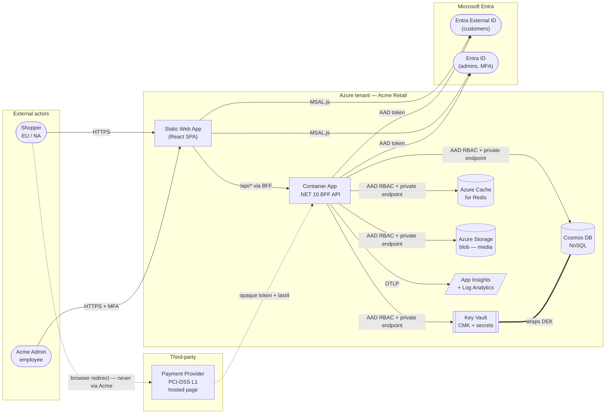
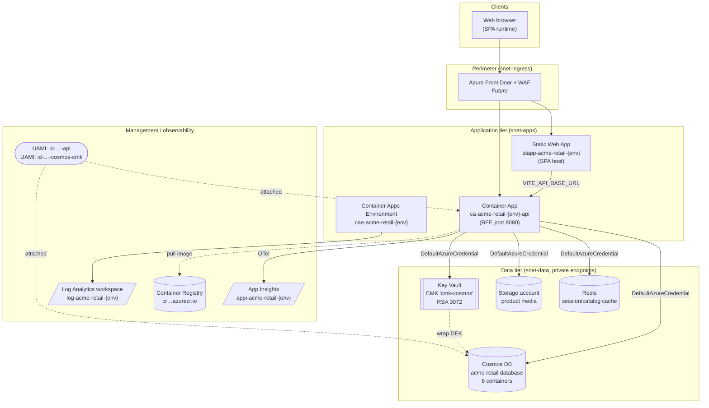
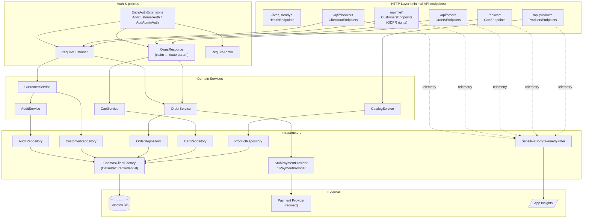
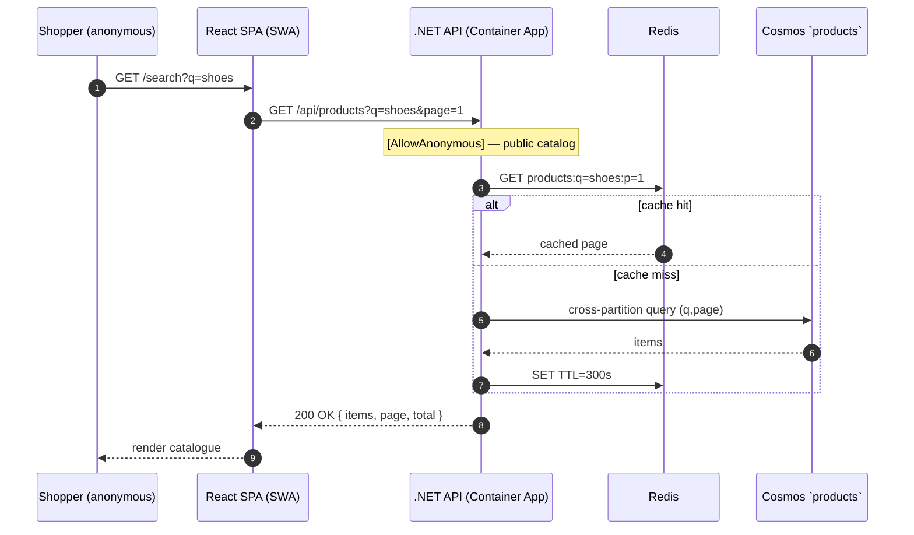
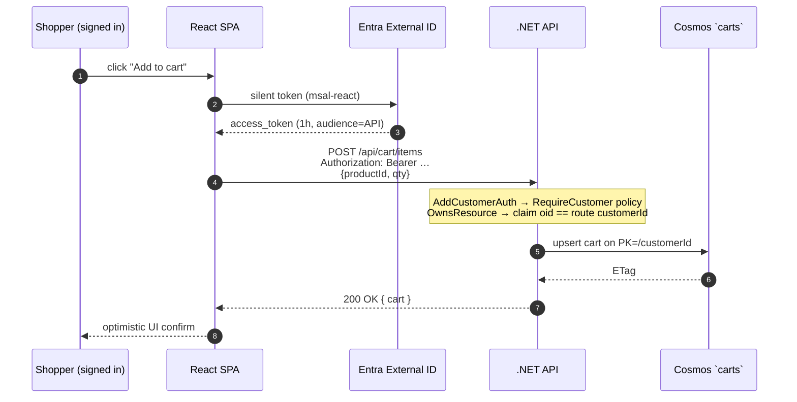
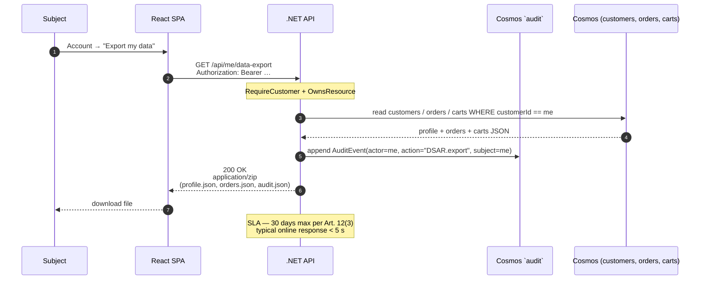

# Acme Retail E-Commerce — Architecture

> **Status:** Living document. Owned by `@acme-retail/platform-engineering`.
> Every claim below traces to an instruction.md rule, a charter, a Bicep
> module, or a source file under `backend/` or `frontend/`. Aspirational
> items are marked `> **Future:**`.

## 1. Overview

Acme Retail is a B2C e-commerce sample that demonstrates a GDPR-compliant,
PCI-scope-reduced, Zero-Trust-aligned shopping experience. The frontend is
a React 18 + TypeScript + Vite + Tailwind SPA hosted on Azure Static Web
Apps. The backend is a .NET 10 minimal API running on Azure Container
Apps, acting as a Backend-for-Frontend (BFF) for the SPA per ADR-0002
(see: `.eas/decisions.md`). Persistence is Azure Cosmos DB (NoSQL) with
customer-managed-key (CMK) encryption on personal-data containers (see:
`infra/modules/cosmos.bicep:73`). Customer identity uses Microsoft Entra
External ID (CIAM); admin identity uses Microsoft Entra ID with MFA (see:
`backend/src/Acme.Retail.Infrastructure/Auth/EntraAuthExtensions.cs`).
Payments are out of CDE scope by design — the browser is redirected to a
PCI-DSS Level-1 provider, stubbed in this sample by
`StubPaymentProvider` (see: `backend/src/Acme.Retail.Infrastructure/Payments/StubPaymentProvider.cs`).

## 2. C4 Context diagram



The dashed line from shopper to provider is the **only** path that carries
PAN/CVV; it never touches Acme infrastructure (see: `.eas/policies/pci.md:14`).

## 3. C4 Container diagram



> **Future:** Front Door + WAF is acknowledged as a sample-mode deviation
> (see: `infra/modules/containerapps.bicep:4-8`); the API ingress is
> currently `external: true` (see: `infra/modules/containerapps.bicep:81`).
> Production deployments per `zero-trust.md §3` set `internal: true` and
> place Front Door in `snet-ingress`.

## 4. C4 Component diagram (API)



Key code references:

- Customer / admin scheme registration — `EntraAuthExtensions.AddCustomerAuth` (see: `backend/src/Acme.Retail.Infrastructure/Auth/EntraAuthExtensions.cs:16`) and `AddAdminAuth` (see: `…/EntraAuthExtensions.cs:60`).
- `OwnsResource` policy ensures the JWT `customerId` claim matches the `{customerId}` route parameter (see: `backend/src/Acme.Retail.Infrastructure/Auth/OwnsResourcePolicy.cs`).
- Cosmos client uses `DefaultAzureCredential` only — connection strings explicitly rejected (see: `backend/src/Acme.Retail.Infrastructure/Cosmos/CosmosClientFactory.cs:22`).
- `IPaymentProvider` abstracts the redirect contract; `StubPaymentProvider` is the dev/test implementation (see: `backend/src/Acme.Retail.Infrastructure/Payments/StubPaymentProvider.cs:17`).
- `SensitiveBodyTelemetryFilter` drops bodies on `/payments`, `/checkout`, `/account/payment-methods`, and `/api/me/payment-methods` (see: `backend/src/Acme.Retail.Infrastructure/Telemetry/SensitiveBodyTelemetryFilter.cs:19`).

## 5. Data model

Cosmos containers are declared in `infra/modules/cosmos.bicep:93-100`:

| Container    | Partition key   | TTL              | Classification | Justification                                                                                                                            |
| ------------ | --------------- | ---------------- | -------------- | ---------------------------------------------------------------------------------------------------------------------------------------- |
| `products`   | `/categoryId`   | none (`-1`)      | Public         | Read-heavy catalog. PK by category spreads writes (new SKUs land in their category) and gives single-partition reads for category pages. |
| `categories` | `/region`       | none (`-1`)      | Public         | Tiny, mostly read. Region partition mirrors locale-specific category trees.                                                              |
| `carts`      | `/customerId`   | 30 d (`2592000`) | Confidential   | One customer's cart is read/written together; per-customer PK gives single-partition CRUD. TTL enforces the 30-day retention rule (see: `.eas/instruction.md:50`). |
| `orders`     | `/customerId`   | none (`-1`)      | Restricted     | Order list pages and order-detail loads are scoped to one customer. Append-only history → write distribution is naturally even.          |
| `customers`  | `/customerId`   | none (`-1`)      | Restricted     | Profile reads/writes are always per-customer (Art. 15/16/17 endpoints). PK = identifier means no fan-out.                                |
| `audit`      | `/aggregateId`  | none (`-1`)      | Restricted     | Aggregate-rooted append log (one partition per aggregate root, e.g. an order or customer). PK by `aggregateId` co-locates the timeline of a single aggregate; subject-scoped queries use a secondary index. |

> **Note on naming:** the container is `audit` (singular) with PK
> `/aggregateId` per the project spec (see: `.eas/project.md:93`,
> `infra/modules/cosmos.bicep:99`). Some external compliance docs refer to
> it as `auditEvents` keyed by `subjectId`; the as-built name and PK take
> precedence. Subject-scoped GDPR queries (Art. 15 export, Art. 17 erasure)
> use a `subjectId` secondary index inside this container.

CMK encryption is enabled at the **account** level, so all six containers
inherit CMK from `cmk-cosmos` in Key Vault (see: `infra/modules/cosmos.bicep:73`,
`infra/modules/keyvault.bicep:64`). The Cosmos account also enforces
`disableLocalAuth: true` (Entra-only data-plane auth — see: `cosmos.bicep:71`)
and `publicNetworkAccess: 'Disabled'` (see: `cosmos.bicep:69`).

## 6. Sequence diagrams

### 6.1 Anonymous product search



### 6.2 Authenticated add-to-cart



Auth wiring: `AddCustomerAuth` registers the `Customer` JWT scheme +
`RequireCustomer` and `OwnsResource` policies (see: `EntraAuthExtensions.cs:42-56`).

### 6.3 Checkout with payment redirect (PCI scope-reducing flow)

```mermaid
sequenceDiagram
    autonumber
    participant U as Shopper
    participant SPA as React SPA
    participant API as .NET API
    participant DB as Cosmos `orders`
    participant P as Payment Provider (PCI L1)

    U->>SPA: review cart, click "Pay"
    SPA->>API: POST /api/checkout<br/>{cartId, shippingAddress}
    API->>DB: create draft order (status=Pending)
    API->>P: CreateSessionAsync(amount, currency, returnUrl)
    Note right of API: StubPaymentProvider in dev;<br/>real provider in prod (ADR-0003)
    P-->>API: { sessionId, redirectUrl }
    API-->>SPA: 303 redirect → redirectUrl
    SPA-->>U: browser navigates to provider
    rect rgba(255,235,200,0.45)
        Note over U,P: PAN + CVV entered HERE only<br/>Acme infra never sees them
        U->>P: card details (HTTPS)
        P-->>U: 302 → Acme returnUrl?session=…
    end
    U->>API: GET /api/checkout/return?session=…
    API->>P: CompleteAsync(sessionId)
    P-->>API: { token: tok_…, last4: 4242, bin: 424242, brand: visa, expiry: 2028-04 }
    API->>DB: order.status=Confirmed, paymentToken, last4, bin, brand
    API-->>U: 200 OK { orderConfirmation }
```

The orange box is the only place a PAN exists. The API only ever receives
the opaque token + the four allowed metadata fields (see:
`StubPaymentProvider.CompleteAsync` — `…/StubPaymentProvider.cs:39`,
`.eas/policies/pci.md:50-56`).

### 6.4 GDPR Data Subject Access Request (Art. 15)



Erasure (Art. 17), rectification (Art. 16), restriction (Art. 18), and
objection (Art. 21) follow the same shape (see: `.eas/policies/gdpr.md:32-39`).

## 7. Non-functional requirements

| Concern        | Target                                                                                                    | Source                                              |
| -------------- | --------------------------------------------------------------------------------------------------------- | --------------------------------------------------- |
| Availability   | Gold tier — 99.9 % monthly, multi-zone within region                                                      | `.eas/project.md:33,100`                            |
| RPO            | 1 h (Cosmos continuous backup → 7-day window)                                                             | `.eas/policies/zero-trust.md:90`, `cosmos.bicep:75` |
| RTO            | 4 h                                                                                                       | `.eas/policies/zero-trust.md:90`                    |
| Read p99       | ≤ 500 ms on `/api/products`, `/api/categories`                                                            | `.eas/instruction.md:43`                            |
| Write p99      | ≤ 1500 ms on `/api/cart`, `/api/orders`                                                                   | `.eas/instruction.md:43`                            |
| Bundle (SPA)   | ≤ 200 KB gzipped on initial route                                                                         | `.eas/instruction.md:42`                            |
| Throughput     | Container App scales 1–5 replicas on 50 concurrent requests/replica                                       | `infra/modules/containerapps.bicep:173-186`         |
| Coverage       | ≥ 90 % line coverage on changed and adjacent code                                                         | `.eas/instruction.md:19`                            |
| Accessibility  | WCAG 2.1 AA on all customer-facing pages                                                                  | `.eas/project.md:103`                               |
| Cyclomatic     | ≤ 10 per function                                                                                         | `.eas/instruction.md:13`                            |

## 8. Cross-cutting concerns

### 8.1 Logging

- **Backend:** Serilog → App Insights with structured JSON output. Personal data is logged only as `customerId` (a GUID; see: `.eas/policies/gdpr.md:60`); never email or name.
- **Sensitive-body redaction:** `SensitiveBodyTelemetryFilter` removes properties named `RequestBody`, `ResponseBody`, `Body`, `RawBody`, `Payload` from `RequestTelemetry`, `DependencyTelemetry`, and `TraceTelemetry` whenever the URL path contains a protected prefix (see: `…/SensitiveBodyTelemetryFilter.cs:74-82`).
- **Forbidden bodies:** logging request bodies on `/payments`, `/checkout`, or `/account` is in `instruction.md.forbidden` (see: `.eas/instruction.md:75`).
- **Frontend:** pino in browser console redirects to App Insights JS SDK; PII filtering is identical (mask email beyond domain part).

### 8.2 Metrics

- **OpenTelemetry SDK** with auto-instrumentation for ASP.NET Core, HttpClient, Cosmos, and Redis.
- **RED** signals (Rate / Errors / Duration) per route — built-in via `Microsoft.AspNetCore.Hosting`.
- **USE** signals (Utilization / Saturation / Errors) for Container App replica — emitted via `Container Apps Environment` integration with Log Analytics (see: `containerapps.bicep:74-77`).
- **Custom counters:** `acme_cart_items_added_total`, `acme_orders_placed_total`, `acme_payment_callbacks_total`, `acme_dsar_requests_total`.

### 8.3 Tracing

- **W3C Trace Context** end-to-end. The SPA initialises App Insights JS SDK with distributed-tracing enabled; the trace-parent header propagates through to the BFF and onward to Cosmos / Redis / Storage.
- `OTEL_SERVICE_NAME` is set to the Container App name (see: `containerapps.bicep:155`).

### 8.4 Error handling

- **RFC 7807 problem details** on all error responses (`application/problem+json`).
- Every response carries a `traceparent`-derived `correlationId` echoed in the body for support reference.
- Domain failures use a `Result<T>` envelope (see: `backend/src/Acme.Retail.Domain/Result.cs`); transport mapping turns failures into 4xx/5xx with stable error codes.

### 8.5 Feature flags

> **Future:** Azure App Configuration with `Microsoft.FeatureManagement` is
> planned. For the sample, feature toggles are environment variables on the
> Container App template (see: `containerapps.bicep:145-156`).

## 9. Deployment topology

| Component         | Strategy                                                                                                                                             |
| ----------------- | ---------------------------------------------------------------------------------------------------------------------------------------------------- |
| Container App     | `activeRevisionsMode: 'Single'` today (see: `containerapps.bicep:110`); 100 % traffic to latest. `maxInactiveRevisions: 3` enables instant rollback. |
| Container App     | > **Future:** switch to `Multiple` revisions + `traffic[]` weights for blue/green or canary releases.                                                |
| Static Web App    | Standard tier with PR-environment previews; production deploys via `azd deploy web` (see: `azure.yaml:11-15`).                                       |
| Cosmos DB         | Single region serverless for the sample (see: `cosmos.bicep:56-66`); production uses provisioned throughput with EU/NA region pinning per data residency rules (see: `.eas/instruction.md:32`). |
| Key Vault         | Soft-delete 90 d, purge-protection ON (see: `keyvault.bicep:54-56`). One CMK key (`cmk-cosmos`, RSA 3072) with annual auto-rotation policy.          |
| ACR               | Premium tier with image signing; Container App pulls via UAMI (see: `containerapps.bicep:128-133`).                                                  |
| Network           | `/16` VNet with four `/24` subnets: `snet-ingress`, `snet-apps`, `snet-data`, `snet-mgmt` (see: `network.bicep:23-29`). NSGs deny-by-default.        |
| Front Door + WAF  | > **Future:** sit in front of SWA + Container App; today the Container App is `external: true` for `azd up` ergonomics (see: `containerapps.bicep:81`). |

Reproducible deploys: every release is a tagged git commit deployable via
`azd up`. The `preprovision` and `postprovision` hooks in `azure.yaml`
seed environment values for the Bicep deploy and run smoke checks
afterwards (see: `azure.yaml:21-31`).

## 10. Local development

Three terminals (per the project's getting-started flow):

1. **Backend:** `dotnet run --project backend/src/Acme.Retail.Api`. Runs on `http://localhost:5000`. `IPaymentProvider` is bound to `StubPaymentProvider`. `DefaultAzureCredential` falls back to `az login` for AAD-bound services or to the local emulator gate (below).
2. **Frontend:** `pnpm --dir frontend dev`. Vite dev-server on `http://localhost:5173`. MSAL is configured for the Entra External ID `dev` tenant; alternatively MSW (Mock Service Worker) intercepts `/api/*` so the SPA runs offline.
3. **Cosmos emulator (optional):** the Linux Cosmos emulator container (`mcr.microsoft.com/cosmosdb/linux/azure-cosmos-emulator:vnext-preview`) provides a local data plane; the API picks it up via `COSMOS__ENDPOINT` and bypasses AAD when the emulator's `accountKey` is supplied via local user-secrets (never committed). Activated only with `--emulator` to keep production code paths AAD-only.

## 11. Technology decisions log

The eight key ADRs from `.eas/decisions.md` and policy files:

| #         | Decision                                                                  | Driver                                       | Source                                |
| --------- | ------------------------------------------------------------------------- | -------------------------------------------- | ------------------------------------- |
| ADR-0001  | Cosmos DB (NoSQL) over Azure SQL                                          | Read-heavy, multi-region, schema flexibility | `.eas/decisions.md:7-31`              |
| ADR-0002  | API-as-BFF (one .NET API per SPA — no Node tier)                          | Simplicity, single auth audience             | `.eas/decisions.md:34-58`             |
| ADR-0003  | Tokenising redirect for payment (full hosted page, not iframe)            | Lowest PCI scope (SAQ-A)                     | `.eas/decisions.md:62-89`             |
| Implicit  | Managed identities only — no client secrets / connection strings          | Zero Trust §1                                | `policies/zero-trust.md:29-32`, `CosmosClientFactory.cs:22` |
| Implicit  | CMK on Cosmos (RSA 3072, KV-hosted, annual rotation)                      | GDPR Art. 32; instruction compliance         | `keyvault.bicep:64`, `cosmos.bicep:73` |
| Implicit  | Private endpoints for all data services; `publicNetworkAccess=Disabled`   | Zero Trust §3, instruction.md compliance     | `cosmos.bicep:69`, `keyvault.bicep:57` |
| Implicit  | Sensitive-body telemetry filter active on payment paths                   | PCI scope reduction (Req. 3, 10)             | `SensitiveBodyTelemetryFilter.cs:19`  |
| Implicit  | Region pinning by classification (EU vs NA)                               | GDPR Chapter V transfers                     | `.eas/instruction.md:32`              |

When adding a new ADR, append to `.eas/decisions.md` and reference the
relevant section of this document.
