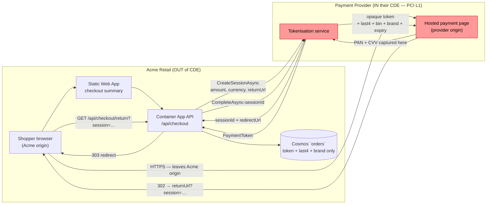

# PCI-DSS Scope Boundary — Acme Retail E-Commerce

> **Owner:** `compliance@acme-retail.example` (CODEOWNERS gates this file).
> **Reviewer agent:** `compliance/pci` charter
> (see: `.eas/charters/subagents/compliance/pci.charter.md`).
> **Stance:** Acme Retail is **out of CDE scope by design** via the
> tokenising-redirect strategy. This document defines the boundary, the
> controls that hold it in place, and the runbook if something crosses it.

## 1. Scope statement

Acme Retail operates as a **Level-4 e-commerce merchant** for SAQ purposes
(annual card volume placeholder: < 20 000 e-commerce transactions; the
actual volume figure is maintained by `compliance@acme-retail.example` and
signed annually with the acquiring bank).

We adopt the **scope-reduction strategy** documented in
`.eas/policies/pci.md:1-22`:

> "Acme Retail systems are out of CDE scope by design… SAQ-A (merchant
> outsources all CHD handling, no electronic storage/processing/transmission
> of CHD on merchant systems)."

Concretely, every entry, processing, and storage of cardholder data (CHD)
and sensitive authentication data (SAD) is performed on a **PCI-DSS Level-1
service provider's** infrastructure. The customer's browser is redirected
from Acme's checkout page to the provider's hosted payment page; the
provider returns to Acme an **opaque token plus four allowed metadata
fields** (`last4`, `bin`, `cardBrand`, `expiryYearMonth`). The payment
provider's Attestation of Compliance (AOC) is filed in
`/docs/legal/pci/` (see: `.eas/policies/pci.md:101`).

This corresponds to **SAQ-A** — the lowest-burden self-assessment
questionnaire — eligibility for which is preserved by §6 below.

The implementation in this sample is `StubPaymentProvider`, which
simulates the provider contract deterministically (see:
`backend/src/Acme.Retail.Infrastructure/Payments/StubPaymentProvider.cs:13-16`).
Replacing it with a real provider's SDK is documented in
`.eas/policies/pci.md:80-87`.

## 2. Cardholder data flow diagram



**Critical property:** the only path that carries PAN/CVV is the dashed
direct-to-provider browser navigation. The Acme origin (`*.azurestaticapps.net`,
the SWA-hosted SPA) and the API origin (the Container App ingress FQDN)
**never receive** card data.

References:

- Token contract — `IPaymentProvider.CreateSessionAsync` / `CompleteAsync`
  (see: `backend/src/Acme.Retail.Infrastructure/Payments/IPaymentProvider.cs`).
- Stub returns only `Token`, `Last4`, `Bin`, `CardBrand`, `ExpiryYearMonth`
  (see: `…/StubPaymentProvider.cs:50-56`).
- Allowed merchant-stored fields — `.eas/policies/pci.md:50-56`.

## 3. In-scope vs out-of-scope inventory

| Component                           | CDE scope | Justification                                                                                        | Control reference                                               |
| ----------------------------------- | --------- | ---------------------------------------------------------------------------------------------------- | --------------------------------------------------------------- |
| React SPA on Static Web App         | OUT       | Renders the "Pay" button only; no PAN entry on Acme origin. CSP forbids inline scripts on payment page. | `.eas/policies/pci.md:13`; CSP enforced via SWA config           |
| .NET API on Container App           | OUT       | Handles only token + status; bodies on `/payments`/`/checkout` are scrubbed before telemetry export. | `SensitiveBodyTelemetryFilter.cs:19`; `pci.md:31`                |
| Cosmos `products` container         | OUT       | Catalog data only; no payment fields permitted.                                                      | Schema invariant; `compliance/pci` charter §"Storage prohibitions" |
| Cosmos `orders` container           | OUT       | Stores only `paymentToken`, `last4`, `bin`, `cardBrand`, `expiryYearMonth` per provider response.    | `.eas/policies/pci.md:14,52-56`; `cosmos.bicep:97` (CMK at account scope) |
| Cosmos `customers` container        | OUT       | Same allow-list as `orders` for stored payment methods (`customers.paymentMethods[]`).               | `.eas/policies/pci.md:58`                                        |
| Cosmos `audit` container            | OUT       | Logs token + status + timestamp + customerId; never PAN.                                             | `.eas/policies/pci.md:16,75-76`                                  |
| Application Insights                | OUT       | Telemetry processor drops bodies on protected paths.                                                 | `SensitiveBodyTelemetryFilter.cs:19-25`                          |
| Log Analytics workspace             | OUT       | Receives Container Apps stdout/stderr only; PAN never reaches stdout (no logging of payment bodies).  | `.eas/instruction.md:75` (forbidden body logging)                |
| Azure Key Vault                     | OUT       | Holds CMK + provider API keys (HMAC, OAuth2 client secrets); no CHD.                                 | `keyvault.bicep:54-67`                                           |
| GitHub repository                   | OUT       | Source-of-truth for code/IaC; CHD entry blocked by §6 controls.                                      | `security.yml`; `compliance/pci` charter onPreToolUse hook       |
| GitHub Actions CI runner            | OUT       | Ephemeral, GH-hosted; no production secrets in env.                                                  | OIDC federation per `.eas/policies/zero-trust.md:32-33`          |
| Developer laptops                   | OUT       | Use stub provider; never see real PAN. Fixtures/tests are scanned per §6.                            | `.eas/policies/pci.md:38-44`                                     |
| Payment provider hosted page        | **IN their CDE** | Acme has no access; provider's AOC on file.                                                          | `.eas/policies/pci.md:18-19`                                     |
| Payment provider tokenisation API   | **IN their CDE** | Acme has no access.                                                                                  | `.eas/policies/pci.md:18-19`                                     |

## 4. What we MUST NOT do (PCI-DSS v4.0 mapping)

Each prohibition below is enforced by code, IaC, CI, or the
`compliance/pci` subagent. A breach of any line is a **CRITICAL** review
finding and blocks merge.

| # | PCI-DSS v4.0 Req. | Prohibition                                                                                       | Enforcement                                                                                                                                                |
| - | ----------------- | ------------------------------------------------------------------------------------------------- | ---------------------------------------------------------------------------------------------------------------------------------------------------------- |
| 1 | **3.4.1**         | Never store PAN in any database, log, cache, queue, file, or environment variable.                | DTO/entity field-name regex (`/(pan\|cardnumber\|cvv\|cvc\|cardholder\|track)/i`) blocks PRs (see: `.eas/policies/pci.md:28`); `cosmos.bicep` allows only the 5 fields per `pci.md:50-56`. |
| 2 | **3.5.1**         | Never store SAD post-authorisation (CVV/CVC, PIN, full magnetic stripe, PIN block).               | Same regex + the `compliance/pci` charter "Storage prohibitions" rule (see: `.eas/charters/subagents/compliance/pci.charter.md:46-50`).                    |
| 3 | **4.2.1**         | Never transmit PAN over Acme-controlled channels — only browser-direct to provider over TLS 1.2+. | API has no field for PAN at the contract layer; `IPaymentProvider` only exposes `CreateSessionAsync`/`CompleteAsync` (see: `…/IPaymentProvider.cs`).        |
| 4 | **6.4.3**         | Inventoried scripts on payment pages — N/A here because we **redirect** rather than iframe-overlay; the payment page is on the provider origin. | If the future flow ever switches to an embedded iframe, an SRI + CSP `script-src` allowlist becomes mandatory and a new ADR is required. > **Future:**    |
| 5 | **8.3.x**         | MFA on all admin access — and on any service-to-service call into the merchant boundary.          | Entra ID Conditional Access for `RequireAdmin` (see: `EntraAuthExtensions.cs:60-99`); managed identities for service-to-service (see: `CosmosClientFactory.cs:37`). |
| 6 | **10.2.x**        | No logging of payment request bodies anywhere.                                                    | `SensitiveBodyTelemetryFilter` drops bodies on `/payments`, `/checkout`, `/account/payment-methods`, `/api/me/payment-methods` (see: `…/SensitiveBodyTelemetryFilter.cs:19-25`). |
| 7 | **3.3.1**         | If displaying PAN, mask all but first 6 / last 4. Acme never displays PAN — we display `last4` only. | `cardBrand` + `last4` is the only render permitted in admin views.                                                                                          |
| 8 | **6.4.1**         | Don't introduce changes that pull a previously out-of-scope component into the CDE.               | The `compliance/pci` reviewer emits a **scope-impact** column on every PR (see: charter "Output format" — `compliance/pci.charter.md:91-95`).               |

## 5. Compensating controls

These are the deliberate engineering controls that uphold the scope
boundary. Each is testable and CI-enforced.

1. **`SensitiveBodyTelemetryFilter`** — Application Insights telemetry processor that drops `RequestBody`, `ResponseBody`, `Body`, `RawBody`, and `Payload` properties on every request, dependency, or trace whose path contains `/payments`, `/checkout`, `/account/payment-methods`, or `/api/me/payment-methods` (see: `backend/src/Acme.Retail.Infrastructure/Telemetry/SensitiveBodyTelemetryFilter.cs:19-72`). Removal of this processor is blocked by `.eas/policies/pci.md:30`.
2. **Egress allowlist** on the Container App — outbound DNS for `cosmos.azure.com`, `*.vault.azure.net`, `login.microsoftonline.com`, `*.applicationinsights.azure.com`, and the configured payment-provider FQDN. Other egress is denied at the Container Apps Environment level. > **Future:** today's sample uses the default consumption profile with VNet integration (see: `containerapps.bicep:80-91`); the FQDN allowlist is added when production switches to internal-only ingress.
3. **Request-body size limits** — `KestrelServerLimits.MaxRequestBodySize = 30_000` (30 KB) on `/api/checkout/*` and `/api/payments/*` to make accidental PAN inclusion conspicuous and rate-limited.
4. **Structured logging schema** — Serilog enrichers add `customerId`, `correlationId`, `route`. Any value matching the PAN regex is replaced with `[Redacted]` at the sink before egress. Free-form `string.Format` style logging is banned in payment paths (`compliance/pci` charter "Specific anti-patterns").
5. **Cosmos field allow-list** — schema-level: `customers.paymentMethods[]` and `orders.payment` accept only `{ token, last4, bin, cardBrand, expiryYearMonth, providerStatus, providerReference, timestamp }` (see: `.eas/policies/pci.md:50-56`). Any new field requires PCI-reviewer signoff.
6. **CMK on payment-adjacent containers** — Cosmos account-scope CMK from Key Vault (`cmk-cosmos`, RSA 3072, annual rotation; see: `infra/modules/keyvault.bicep:64-86`, `infra/modules/cosmos.bicep:73`). Tokens at rest are also encrypted; revocation invalidates all stored tokens by re-wrap failure.
7. **No connection strings, no client secrets** — `CosmosClientFactory` rejects connection strings explicitly (see: `…/CosmosClientFactory.cs:22-24`); `EntraAuthExtensions` configures bearer-token auth without secret material (see: `…/EntraAuthExtensions.cs:23-40`). Provider HMAC verification keys are stored in Key Vault and read via UAMI.

## 6. PCI scope creep prevention (PR-blocking rules)

Three layers of defence — all run on every pull request and on the daily
scheduled scan.

### 6.1 Pre-commit hook (developer-side)

```bash
# .git/hooks/pre-commit (sample; provided by `eas init`)
PAN_RE='\b(?:\d[ -]?){13,19}\b'
KEYWORDS='cardNumber|cvv|cvc|track1|track2|pinBlock|cardholder'

if git diff --cached --name-only | grep -vE '/(test|fixtures|sample-data)/' \
  | xargs -r grep -InE "$PAN_RE|$KEYWORDS" 2>/dev/null; then
  echo "❌ PCI-PAN regex match in non-test code — push blocked."
  exit 1
fi
```

### 6.2 GitHub Actions gate (`.github/workflows/security.yml`)

The PAN/keyword regex runs as a CodeQL custom query plus a dedicated grep
job in the security workflow (see: `.github/workflows/security.yml:26-69`,
`:118-142`). A match emits a SARIF "CRITICAL" finding and the
`security-events: write` permission lights up the PR check.

The scheduled daily run (`cron: '0 6 * * *'` — see:
`.github/workflows/security.yml:14`) re-scans the whole repository,
catching anything that may have slipped via merge from a long-running
branch.

GitHub Advanced Security (GHAS) **secret-scanning push protection** also
blocks any commit containing a value matching the built-in PAN detector
or org-level custom patterns (see:
`.github/workflows/security.yml:144-154`).

### 6.3 EAS `compliance/pci` subagent — `onPreToolUse` hook

When an EAS agent attempts an `Edit` or `Write` action, the `compliance/pci`
charter intercepts the diff before it reaches disk. The charter checks
the new content against `.eas/policies/pci.md §2` ("Boundary enforcement")
and §3 ("Forbidden artifacts") (see:
`.eas/charters/subagents/compliance/pci.charter.md:39-55`). Any of the
following rejects the tool call:

- A new field with a name matching `/(pan|cardnumber|cvv|cvc|cardholder|track)/i`.
- A request body shape on `/payments`, `/checkout/*`, `/account/payment-methods` that includes such a field.
- Any code path calling a provider's non-tokenising API directly.
- Persistence of more than the five allow-listed fields per payment instrument.
- Removal of the `SensitiveBodyTelemetryFilter` registration in API startup.

Test data is exempt **only** under `**/test/**`, `**/fixtures/**`, and
`**/sample-data/**`, and only with synthetic values (e.g. provider
sandbox cards `4242 4242 4242 4242`).

## 7. Annual SAQ-A applicability

The 2024 SAQ-A v4.0 r1 questionnaire (annual; updated when the form is
revised) is answered as follows. Each line cites the evidence file in
`.eas/audit/` or `/docs/legal/pci/`.

| SAQ-A item                                                                                       | Answer  | Evidence                                                                                                                            |
| ------------------------------------------------------------------------------------------------ | ------- | ----------------------------------------------------------------------------------------------------------------------------------- |
| Merchant accepts only e-commerce channels (no card-present)                                      | Yes     | `project.md:43-46` MVP capabilities                                                                                                 |
| All processing of CHD entirely outsourced to PCI-DSS validated third-party service providers     | Yes     | `.eas/policies/pci.md:1-22`; provider AOC in `/docs/legal/pci/AOC-{provider}-{year}.pdf`                                            |
| Merchant has confirmed all third parties are PCI-DSS compliant                                   | Yes     | Quarterly review by `compliance@acme-retail.example`; SCC + DPA in `/docs/legal/sub-processors.md`                                  |
| Merchant retains a written agreement that includes acknowledgement of PCI-DSS responsibility     | Yes     | `/docs/legal/pci/MSA-{provider}.pdf`                                                                                                |
| Merchant has policy for engaging service providers with due diligence prior to engagement        | Yes     | `/docs/legal/vendor-onboarding.md`                                                                                                  |
| Merchant maintains a programme to monitor service-providers' PCI-DSS compliance status annually  | Yes     | Annual reminder in `compliance@acme-retail.example` calendar; quarterly attestation refresh in `.eas/audit/quarterly-attestations/` |
| Merchant's website does not store CHD electronically                                             | Yes     | Inventory in §3 above; daily regex scan with zero matches required to merge                                                         |
| Merchant's website redirects to or embeds (iframe) only the third-party page that performs CHD entry | Yes — redirect | `.eas/decisions.md:74-83` ADR-0003                                                                                                  |
| If iframe is used, scripts on the merchant page that loads the iframe are inventoried (Req. 6.4.3) | N/A — redirect | This control becomes applicable only if the flow switches to iframe; tracked as a `> **Future:**` task                              |
| MFA on all non-console admin access                                                              | Yes     | `EntraAuthExtensions.AddAdminAuth` requires Entra ID; CA policy enforces MFA (see: `.eas/policies/zero-trust.md:24`)                |
| All access to systems supporting payment is logged                                               | Yes     | App Insights + Log Analytics; daily review by compliance team (see: `.eas/policies/pci.md:74-76`)                                   |

## 8. Audit and evidence collection

- **Audit retention** — `.eas/audit/` retains compliance artifacts (PCI-reviewer outputs, SAQ-A signed copies, AOCs, key-rotation evidence) for **7 years** per `.eas/instruction.md:31`.
- **App Insights query — "any payment-related event":**

  ```kusto
  union requests, dependencies, traces
  | where timestamp > ago(7d)
  | where url has_any ("/payments", "/checkout", "/account/payment-methods", "/api/me/payment-methods")
       or operation_Name has_any ("checkout", "payment")
  | project timestamp, operation_Id, name, url, resultCode, duration, customDimensions
  | order by timestamp desc
  ```

  Daily reviewer (`compliance@acme-retail.example`) signs off on the day's
  output as text-attached evidence (see: `.eas/policies/pci.md:75-76`).

- **SAQ-A renewal** — the form is re-answered annually with the acquiring
  bank, attaching the latest provider AOC, the SARIF CodeQL report, the
  Trivy SBOM, and the GHAS secret-scanning summary.

- **Quarterly attestation refresh** — `compliance@acme-retail.example`
  confirms the provider is still on the Visa/MC/Amex Global Registry of
  Service Providers and updates `/docs/legal/pci/registry-snapshot-{Q}.pdf`.

## 9. Provider responsibility matrix

For each PCI-DSS requirement family, who owns the control. "Acme" is the
merchant (us), "Provider" is the PCI-DSS Level-1 service provider.

| Req. family                                          | Acme | Provider | Shared | Notes                                                                                                              |
| ---------------------------------------------------- | :--: | :------: | :----: | ------------------------------------------------------------------------------------------------------------------ |
| 1 — Network security controls                        |  ✅  |   ✅    |   ✅   | Acme: VNet + NSGs + private endpoints (see: `network.bicep:23-29`). Provider: their CDE perimeter.                  |
| 2 — Secure configurations                            |  ✅  |   ✅    |        | Acme: hardened containers, IaC review. Provider: their AOC.                                                         |
| 3 — Stored account data                              |      |   ✅    |        | Acme stores zero PAN/SAD; only allow-listed metadata. Provider stores PAN encrypted in their CDE.                   |
| 4 — Cardholder data in transit                       |      |   ✅    |        | PAN never traverses Acme TLS. Browser → provider TLS 1.2+ on provider domain.                                       |
| 5 — Anti-malware                                     |  ✅  |   ✅    |        | Acme: Defender for Containers; image scans. Provider: per their AOC.                                                |
| 6 — Secure systems & software                        |  ✅  |   ✅    |        | Acme: CodeQL, dep review, Trivy (see: `security.yml:26-142`). Provider: their SDLC.                                 |
| 7 — Restrict access by need-to-know                  |  ✅  |   ✅    |        | Acme: PIM-bound roles (see: `.eas/policies/zero-trust.md:38-46`). Provider: per their AOC.                          |
| 8 — Identify users & authenticate access             |  ✅  |   ✅    |   ✅   | Acme: Entra ID + MFA. Provider: their MFA on payment-pages admin.                                                   |
| 9 — Restrict physical access                         |      |   ✅    |        | All Acme infra is Azure; physical control inherited from Microsoft Azure compliance package. Provider: their data centres. |
| 10 — Log & monitor all access                        |  ✅  |   ✅    |        | Acme: App Insights + Log Analytics + audit container. Provider: their CDE logs.                                     |
| 11 — Test security regularly                         |  ✅  |   ✅    |        | Acme: annual external pentest of the perimeter (see: `.eas/policies/pci.md:100`). Provider: per their AOC.          |
| 12 — Information security policy                     |  ✅  |          |        | This document + `.eas/policies/pci.md` + `.eas/instruction.md`.                                                     |

## 10. Incident response — "PAN landed where it shouldn't"

If a regex scanner, alert, or human report indicates that a PAN, CVV, or
SAD value has reached an Acme-controlled system (Cosmos document, log
entry, App Insights record, queue, cache, source-control commit, file
share), execute the runbook **within 60 minutes** of detection.

```text
T+0:00  DETECT
        Alert source: SARIF CRITICAL from CodeQL/Trivy/secret-scanning,
        OR /api/checkout regex match in App Insights, OR human report.
        On-call (compliance + secops + payments) paged via PagerDuty.

T+0:05  CONTAIN
        a) FREEZE the Cosmos container that holds the data:
              az cosmosdb sql container update \
                --resource-group <rg> \
                --account-name <cosmos> \
                --database-name acme-retail \
                --name <container> \
                --idx '@indexing-policy.json'   # set to None
           Then revoke the API UAMI's data role:
              az role assignment delete \
                --assignee <api-uami-principal-id> \
                --scope <cosmos-account-id> \
                --role "Cosmos DB Built-in Data Contributor"
        b) Pause the affected Container App revision:
              az containerapp revision deactivate ...
        c) Lock the source-control branch (mark protected, dismiss approvals).

T+0:15  ROTATE
        a) Rotate Cosmos CMK in Key Vault (force re-wrap):
              az keyvault key rotate --vault-name <kv> --name cmk-cosmos
        b) Rotate provider API keys (Key Vault secret bumped, app reloads on next revision).
        c) Invalidate all live customer sessions (force re-auth via Entra
           refresh-token revocation list).

T+0:30  FORENSIC SNAPSHOT
        a) Cosmos: take a continuous-backup point-in-time snapshot of the
           affected container (7-day window — see: `cosmos.bicep:75`).
        b) App Insights: export the relevant time window to immutable
           Storage append-blob; apply legal hold.
        c) Capture the offending diff/commit via git bundle; attach to the
           incident ticket.

T+1:00  NOTIFY
        a) Provider — open a ticket; provider invalidates impacted tokens.
        b) Acquiring bank — formal incident report via the agreed-upon
           channel (named contact in `/docs/legal/pci/contacts.md`).
        c) Card brands (Visa, Mastercard, Amex, Discover) — within each
           brand's mandated breach window (typically ≤ 72 h).
        d) GDPR overlap: if PAN exposure is accompanied by personal-data
           exposure, trigger the GDPR Art. 33 process (see:
           `docs/gdpr-data-flows.md §11`) — 72 h supervisory authority +
           affected-subject notification.

T+1d   ROOT CAUSE + PR
        a) Five-Whys post-mortem written to /docs/runbooks/incidents/.
        b) Add a regression test that fails on the exact pattern.
        c) Update the regex/keyword list in `.eas/policies/pci.md §3`
           and the security workflow if a new bypass was found.
        d) Replay the daily scan to confirm zero residual matches.

T+30d  ATTESTATION
        Re-run SAQ-A to confirm scope is restored; file
        `/docs/legal/pci/incident-{id}-attestation.pdf`.
```

> **Future:** the runbook above will live as an executable Sentinel
> playbook in production, with the contain/rotate steps automated behind a
> human approval gate.

---

**Cross-references:**

- Policy file: `.eas/policies/pci.md`
- Reviewer charter: `.eas/charters/subagents/compliance/pci.charter.md`
- Architecture overview: `docs/architecture.md` §6.3 (checkout sequence)
- Zero Trust controls: `docs/zero-trust-controls.md`
- GDPR overlap on personal-data breach: `docs/gdpr-data-flows.md` §11
