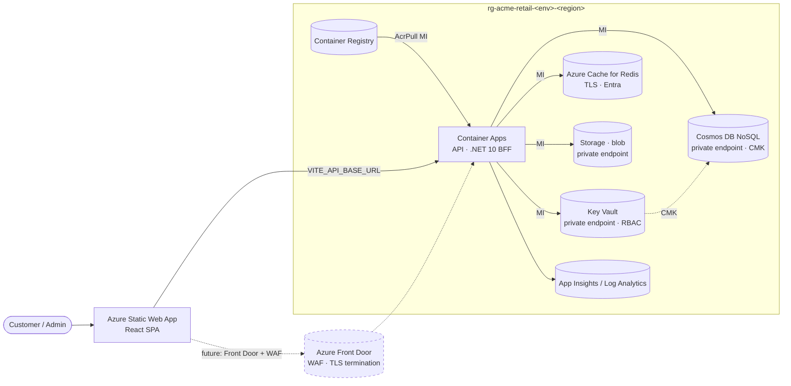

# Acme Retail E-Commerce — Infrastructure (Bicep + azd)

This directory provisions the full Azure footprint for the Acme Retail
e-commerce sample. Everything is composed from `infra/main.bicep`
(subscription scope) which calls `infra/core.bicep` (resource-group scope),
which in turn composes nine focused modules under `infra/modules/`.

## Architecture



Solid arrows = deployed by `azd up`. Dashed = production add-ons documented in
the deviation table below.

## What `azd up` does

1. `preprovision` hook validates the Bicep templates locally.
2. `azd provision` deploys `main.bicep` at subscription scope, which:
   - creates `rg-acme-retail-${AZURE_ENV_NAME}-${AZURE_LOCATION}`
   - deploys `core.bicep` into that RG
   - creates VNet, subnets, NSGs, private DNS zones
   - creates UAMIs, Key Vault (+ CMK key + role assignments), Cosmos with CMK,
     Redis, Storage, ACR, Container Apps Environment, Container App, Static
     Web App
   - assigns least-privilege roles to the API UAMI at *resource* scope
3. `azd deploy api` builds the .NET image (using `Dockerfile`), pushes to ACR,
   and creates a new Container App revision pointing at it.
4. `azd deploy web` builds the SPA and uploads it to the SWA.
5. `postprovision` hook prints endpoints and reminds the operator of
   out-of-band Entra setup steps.

## First-run quickstart

```bash
cd sample/ecommerce-app
azd auth login
azd env new dev
azd env set AZURE_LOCATION eastus2
azd env set AZURE_PRINCIPAL_ID "$(az ad signed-in-user show --query id -o tsv)"
azd up
```

## Entra External ID — manual setup checklist

The Bicep templates do not provision Entra tenants (no public ARM resource).
Once `azd up` finishes, complete this out-of-band checklist:

- [ ] Create an Entra External ID tenant in the Azure portal
      (`Microsoft Entra External ID → Create tenant → External`)
- [ ] In that tenant, register an app for the SPA:
      - Redirect URIs: `https://<swa-default-hostname>/auth/callback`
      - Implicit grant: disabled (we use PKCE)
      - Token claims: `email`, `oid`, `tid`, `customerId` (custom)
- [ ] Add a user flow `B2C_1A_signup_signin` (sign-up + sign-in, MFA on
      `payment-method-add`, `address-change`)
- [ ] Capture: `CLIENT_ID`, `TENANT_ID`, `AUTHORITY` (the user-flow URL)
- [ ] In the SWA, set app settings (or via CI):
      - `VITE_AZURE_AD_CLIENT_ID`
      - `VITE_AZURE_AD_TENANT_ID`
      - `VITE_AZURE_AD_AUTHORITY`
- [ ] Repeat with a separate Entra ID (workforce) tenant + admin app for the
      `/admin/*` surface, gated by an MFA Conditional Access policy.

## Cost estimate (idle dev environment, USD/month)

| Resource | Idle | With light traffic | Notes |
|---|--:|--:|---|
| Resource group + VNet + NSGs + Private DNS | $0 | ~$1 | Private DNS zones $0.50/zone/mo (×4) |
| Private endpoints (×4) | ~$30 | ~$30 | $7.30/endpoint/mo |
| Cosmos DB (Serverless) | ~$0 | $5–25 | Pay-per-RU; idle = ~$0 |
| Azure Cache for Redis (Basic C0) | ~$16 | $16 | Sample SKU; production must upgrade to Premium |
| Container Apps (Consumption) | ~$0 | $5–15 | scale-to-zero on idle apps |
| Container Registry (Standard) | ~$20 | $20 | Required for private repos |
| Static Web App (Standard) | ~$9 | $9 | Standard tier required for app settings + linked backends |
| Log Analytics + App Insights | ~$2 | $5–15 | 30-day retention |
| Key Vault | <$1 | <$1 | Per-operation pricing |
| Storage (Standard LRS) | <$1 | <$1 | Few MB of product images in dev |
| **Total** | **~$80/mo** | **~$100–135/mo** | |

> Cost-trade-off note: Redis Premium (the production-grade SKU with private
> endpoint and `publicNetworkAccess=Disabled`) starts at **~$415/mo**. The
> sample uses Basic C0 to keep dev cost down — flip `usePremium` in
> `core.bicep` for production.

Daily idle ballpark: **$2–3/day**.

## `azd down` cleanup

```bash
azd down --purge --force
```

`--purge` is required because Key Vault has soft-delete + purge protection
enabled. Without it, a follow-up `azd up` in the same region within 90 days
will fail with a name conflict.

## Sample-mode deviations from production

| Control | Production target | Sample-mode value | Why | Where to flip |
|---|---|---|---|---|
| Container Apps ingress | Internal-only behind Front Door + WAF | External HTTPS | Sample testability without paying for Front Door | `infra/modules/containerapps.bicep` `vnetConfiguration.internal` |
| Redis SKU | Premium (private endpoint, publicNetworkAccess=Disabled) | Basic C0 (TLS-only, public) | $399/mo cost delta | `infra/core.bicep` `usePremium` param to `redis` module |
| ACR network | Private endpoint, publicNetworkAccess=Disabled (Premium SKU) | Public, Standard SKU | $400/mo cost delta vs Premium | `infra/modules/registry.bicep` |
| Backups in separate subscription | Cross-subscription private link | Single-subscription, Cosmos continuous backup | Sample uses one sub | Out of scope for sample |
| HSM-backed keys (Premium KV) | Managed HSM or KV Premium | Standard KV with software-protected RSA 3072 | Cost | `infra/modules/keyvault.bicep` SKU |

Every other control listed in `.eas/instruction.md` and `.eas/policies/`
(no client secrets, MI everywhere, NSGs deny-by-default, no `0.0.0.0/0`,
TLS 1.2+, CMK on Cosmos personal-data containers, no subscription-scope
RBAC, soft-delete + purge protection on KV) is enforced as-is.

## File map

```
infra/
  abbreviations.json         standard Microsoft resource-prefix table
  main.bicep                 subscription-scope orchestrator (creates RG)
  core.bicep                 RG-scope composer
  main.parameters.json       azd substitutions
  hooks/
    preprovision.sh
    postprovision.sh
  modules/
    network.bicep            VNet, subnets, NSGs, private DNS zones
    identity.bicep           API UAMI
    monitor.bicep            Log Analytics + App Insights
    keyvault.bicep           KV + CMK key (RSA 3072) + role assignments
    cosmos.bicep             Cosmos NoSQL + 6 containers + CMK + PE
    redis.bicep              Cache (Basic for sample / Premium for prod)
    storage.bicep            Blob storage + PE + soft-delete
    registry.bicep           ACR + AcrPull bindings
    containerapps.bicep      Environment + API container app
    swa.bicep                Static Web App
README.md                    this file
```
